.. _file-submissions:

File Submissions
================

The CRDS website provides a number of functions used to submit new reference
files or rules.

This section describes the processes of submitting files to CRDS.  It does not
detail the formats and requirements of *creating* files which are described
better elsewhere,  such as `HST Reference Files Information`_, `JWST CAL Documentation`_, or `Roman Cal Documentation`_.

.. _`HST Reference Files Information`: http://newcdbs.stsci.edu/doc/index.html

.. _`JWST CAL Documentation`: https://jwst-pipeline.readthedocs.io/en/latest/jwst/package_index.html

.. _`Roman Cal Documentation`: https://roman-pipeline.readthedocs.io/en/latest/roman/package_index.html

Required CRDS Account
.....................

Submitting files to CRDS requires obtaining a CRDS account authorizing you to
do so.  These permissions are managed by CRDS and checked automatically after
your MyST identity is verified.

To obtain a CRDS account,  please file a ticket with the `CRDS Jira`_
project requesting authorization so submit files.

.. _`CRDS Jira`:  https://jira.stsci.edu/projects/CRDS/issues

**IMPORTANT** Your MyST identity is connected to your CRDS permissions via your
MyST e-mail.  You should specify your MyST e-mail when applying for a CRDS
account.

Logging In
..........

Privileged tasks in CRDS such as:

1. Submitting new files
2. Managing the context

require authenticating with the CRDS server.

Authentication Overview
+++++++++++++++++++++++

Logging in requires what can be a multi-step workflow.  The steps of logging in
are:

1. Instrument selection  (Pipeline operators select "none")
2. MyST authentication  (skipped if done previously)
3. Auth.mast token authorization (skipped if done previously)
4. CRDS server account verification  (hidden unless fails)
5. Instrument locking (hidden unless fails)

In addition to basic MyST and auth.mast authentication,  CRDS adds
the requirement that you have a CRDS account and that you lock any
instrument for which you are submitting files.

Instrument Selection
++++++++++++++++++++

The first step of logging in is to select the instrument for which you will be
submitting files.  Eventually during login, CRDS will lock this instrument so
that you have exclusive access for one submission.  If a lock cannnot be
obtained because someone else has it, your login will fail.  This prevents your
changes from colliding with another's in CRDS and the loss of work.

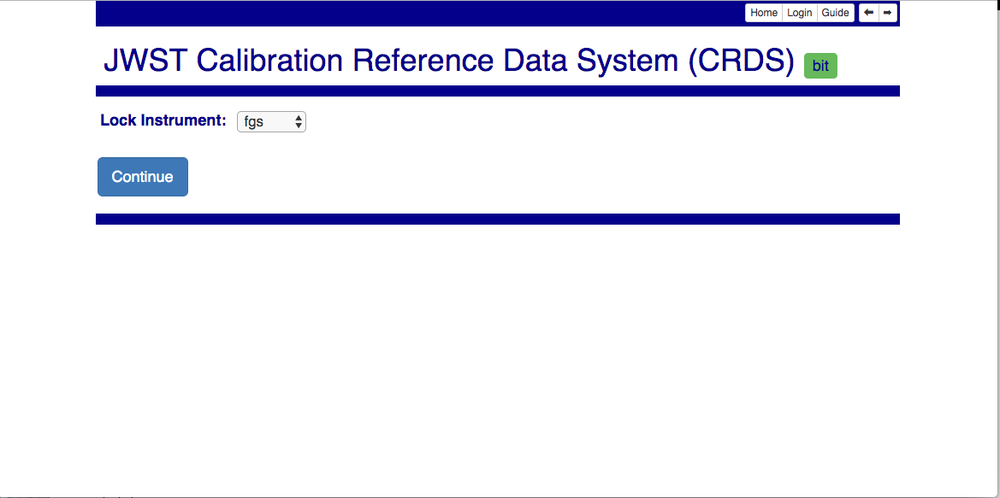

MyST Authentication
+++++++++++++++++++

The outer-most layer of CRDS authentication is to authenticate with MyST.  This
proves to CRDS that you're participating with STScI in a general way.  This
step requires entry of your e-mail or username and AD password and may also
entail related two factor authorization not shown.

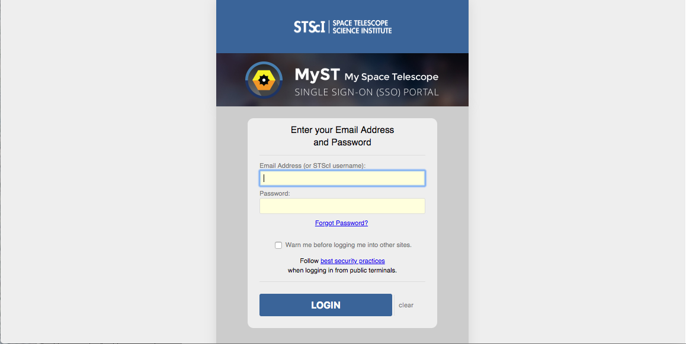

Auth.mast Authorization
+++++++++++++++++++++++

auth.mast may request that you authorize CRDS to obtain a token.  These
tokens are the way in which CRDS obtains your MyST identity.

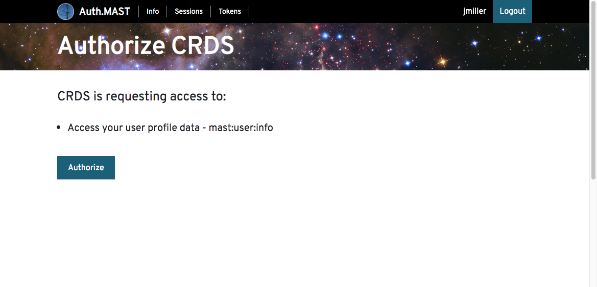

CRDS Instrument Locking
+++++++++++++++++++++++

When a user logs in, the instrument they've locked and the time remaining on
the lock are displayed next to the home button:

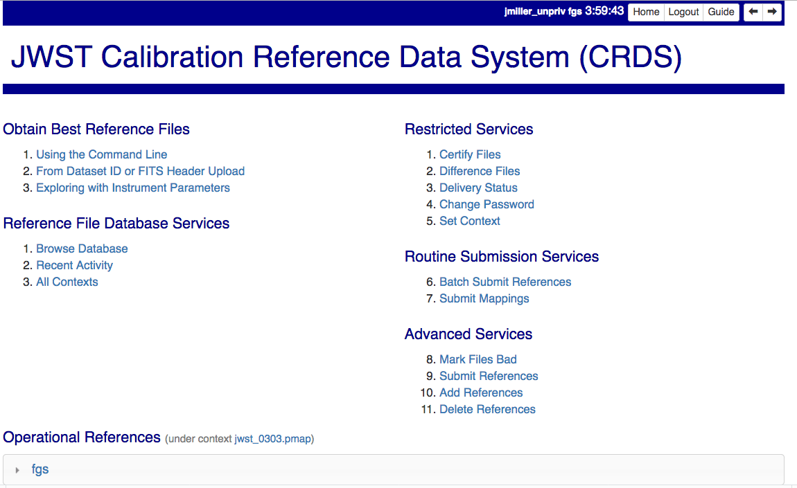

Instrument locking is used to prevent conflicting modifications to the same
CRDS rules files by simultaneous files submissions.

Other users who attempt to login for the same instrument while it is locked
will be denied.   When the lock holder confirms or cancels their submission,'
the lock is released so that others can proceed.

When the user performs an action on the website, their lock timer is reset to
its maximum value.

If your lock times out, another user can take the lock and submit files to the
same instrument and reference type.  Different instruments or reftypes should
not cause conflicts.  Submitting to the same instrument and reftype will
generally cause the first set of conflicting rules changes to be lost.

Forced submissions should be carefully coordinated since by definition locking
protections are not in place.

Care should be taken with the locking mechanism and file submissions.  **DO NOT**:

* Don't login from multiple browsers or sites.  The last browser/site you log
  in from will steal the lock from the original login.  While this won't abort
  any submission, it will open the possibility for conflict and require earlier
  submissions waiting for confirmation to be *forced*.

* You cannot login for more than one instrument at a time.

* Don't perform multiple file submissions for the same instrument at the same
  time.  Finish and confirm or cancel each file submission before proceeding
  with the next.

Extended Batch Submit References (new)
......................................

*Extended Batch Submit References* acquires extra submission metadata prior to
continuing to the original *Batch Submit References* page.  It is the new
approach expected for submitting most reference files.

In both cases, CRDS checks incoming reference files, generates appropriate rmap
updates, and presents checking results and rmap differences to the submitter.

The new web form, which begins as shown, fully supersedes the old form:

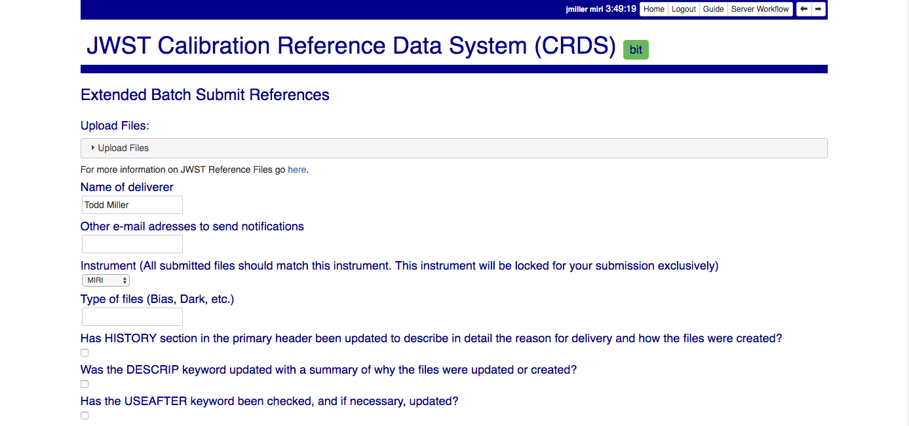

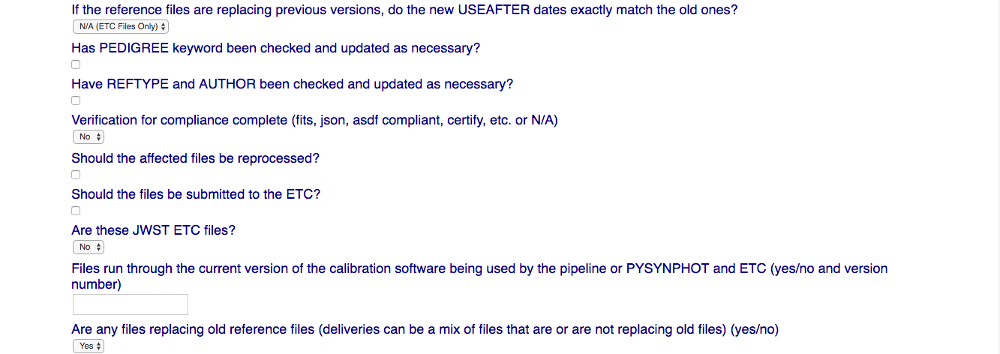

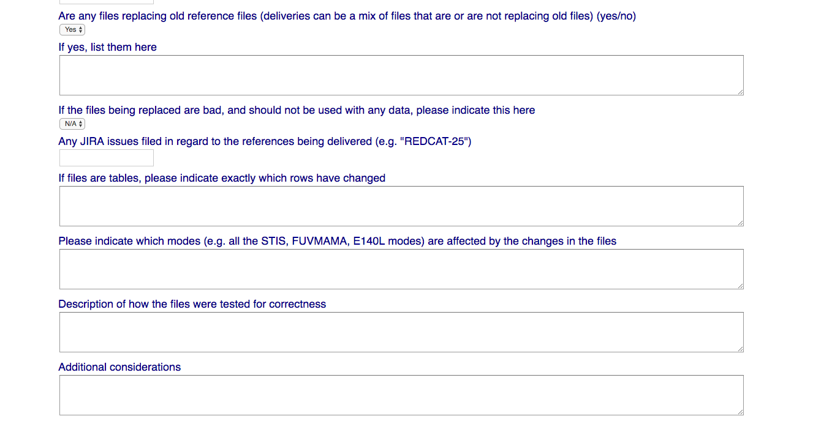

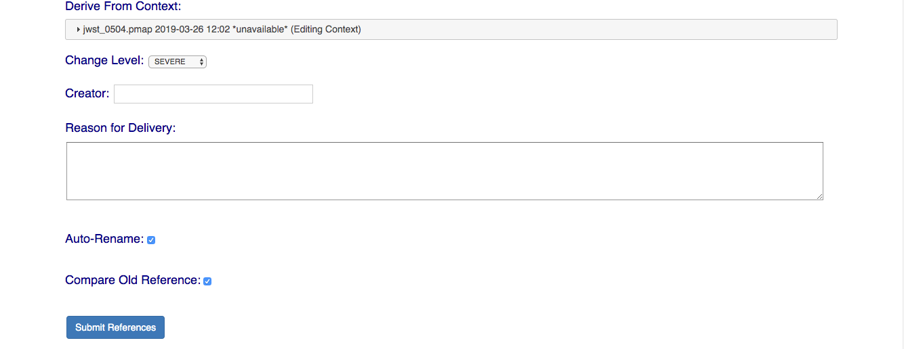

**NOTE:** *Checked* or *Yes* answers for many fields are required for your
submission to succeed; many of the form fields are reminders of the ReDCaT
requirements for submitting files to CRDS.

The following section on *Batch Submit References* describes the remainder of
processing for *Extended Batch Submit References*;  the only real difference
is the simplified input form.

Batch Submit References (deprecated)
....................................

While deprecated, *Batch Submit References* remains available for use as
needed.  Most CRDS processing is identical to that of *Extended Batch Submit
References*, the primary difference is that the *Extended Batch Submit
References* form collects more metadata and creates a record of the submission
before proceeding to the original functions.

The specified reference files are checked on the server using crds.certify and
if they pass are submitted to CRDS.

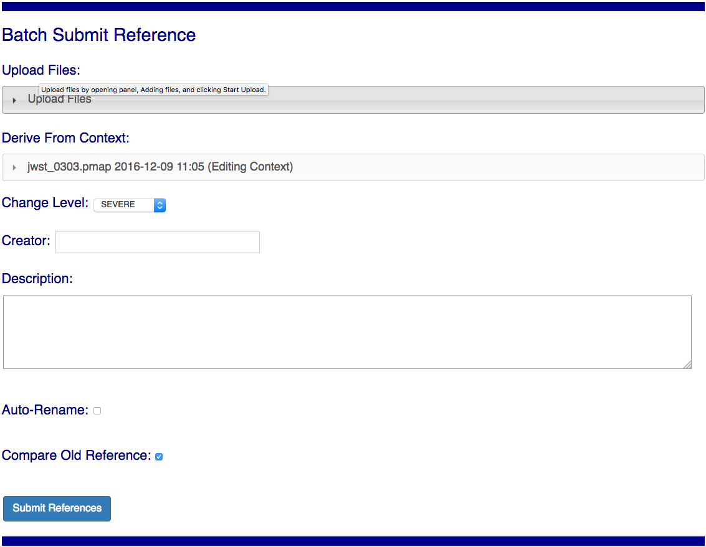

Upload Files
++++++++++++

The first task involved with *Batch Submit References* is transferring the
submitted files to the server.  Each CRDS user has their own ingest directory
so while users can work in parallel they are each limited to one delivery at a
time.  This section applies equally to all of the file submission pages that
have an *Upload Files* accordion.

On the file submission pages,  the *Upload Files* accordion opens to support
uploading submitted files to a user's CRDS ingest directory via the browser.

.. figure:: images/web_upload_files.png
   :scale: 50 %
   :alt: file upload accordion

Uploading files is accomplished by:

* Opening the accordion panel by clicking on it.

* Add files to the upload list by clicking on the *Add Files...* button.

* Click *Start Upload* to initiate the file transfer.   When the upload successfully completes the buttons will change to *delete*.

* Click *Delete* for any file added by mistake or for failed uploads.

* Click *Cancel Upload* to abort a file transfer during the upload.

* Close the accordion panel by clicking on it.

**IMPORTANT**  Just adding files to the file list does not upload them.   You
must click *Start upload* to initiate the file transfer.

Derive From Context
+++++++++++++++++++

The specified context is used as the starting point for new automatically
generated context files and also determines any predecessors of the submitted
references for comparison during certification.   If all the submitted reference
files pass certification,  new .rmap's, .imap, and .pmap are generated
automatically to refer to the newly added references.

Based on their header parameters, references are automatically assigned to
appropriate match locations in the .rmap file.

.. figure:: images/web_derive_from_context.png
   :scale: 50 %
   :alt: context specification

There are two special contexts in CRDS which are tracked:

Edit Context
!!!!!!!!!!!!

*Edit Context* is the default context used for adding new files.  Whenever a new
.pmap is created or added, it becomes the editing context from which future
.pmaps are derived by default.

In this way CRDS deliveries normally chain from one context to the next in a
linear flow which can advance ahead of the *Operational Context* indefinitely
to support last minute testing prior to being used for real calibrations.  In
almost all cases, eventually the current *Edit Context* is adopted for use in
the archive pipeline and effectively becomes the *Operational Context*.

Operational Context
!!!!!!!!!!!!!!!!!!!

*Operational Context* is the .pmap which is nominally in use by the pipeline.
While it's common to make new files operational as each context is added, it's
possible for the *Operational Context* to lag behind the *Edit Context* when
new files are being added but need additional testing in OPS.   Deriving
from the *Operational Context* is a crude kind of reversion since CRDS
effectively branches around any existing subsequent contexts.

Recent
!!!!!!

*Recent* lists a number of recently added contexts based on delivery
time. Using a *Recent* context instead of the *Edit Context* is a crude kind of
reversion, CRDS effectively branches around existing subsequent contexts.

User Specified
!!!!!!!!!!!!!!

Any valid CRDS context can be typed in directly as *User Specified* and used
as the baseline for the next context.   This is also a kind of reversion and
branching.

Auto Rename
+++++++++++

Normally files uploaded to CRDS will be assigned new unique names. Unchecking
`Auto Rename` will request that CRDS use the uploaded file name as the official
name.  The CRDS database remembers both the name of the file the submitter
uploaded as well as the new unique name.

Turning off Auto Rename should be done judiciously if at all.   It's
appropriate in situations where uploaded files already have known unique names
which it is desirable to keep.

  * For JWST and Roman calibration references, in general Auto Rename should not be
    turned off.

  * For HST calibration references which are assigned unique names prior to
    being submitted to CRDS, it is appropriate to turn Auto Rename off.

  * For SYNPHOT references, it was previously recommended to turn Auto Rename
    off, so that thermal and throughput table files would retain their
    hand-selected names.  Now, thermal/throughput table files are never renamed
    (regardless of Auto Rename value), so the checkbox only controls renaming
    of the TMG, TMC, TMT, and obsmodes files, and should generally be left on.

  * For hand-edited CRDS rules files (pmaps, imaps, rmaps) it can be
    appropriate to turn Auto Rename off if file naming and header fields
    have already been properly assigned.

Compare Old Reference
+++++++++++++++++++++

When `Compare Old Reference` is checked, CRDS will certify incoming tabular references against the files
they replace with respect to the derivation context.   For other references this
input is irrelevant and ignored.

Results
+++++++

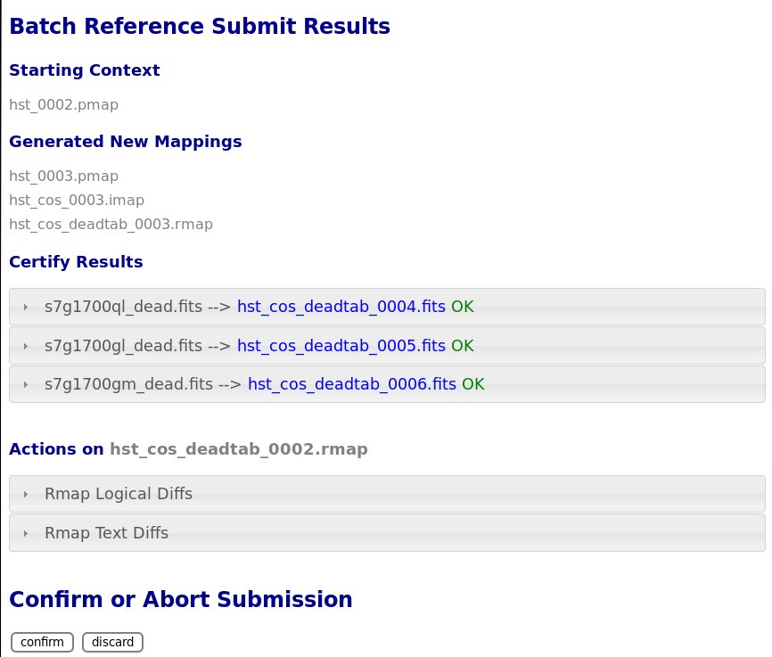

The results page lists the following items:

* *Starting Context* is the context this submission derove from.

* *Generated New Mappings* lists the new mapping files which provide the generated context for using the submitted references.

* *Actions on Rmap* provides two accordions showing how the rmap controlling
  the submitted references was modified.  The logical differences accordion has
  a table of actions, either *insert* for completely new files or *replace* for
  files which replaced an existing file.  The text differences are essentially
  output from UNIX *diff* for the old and new rmaps.

* *Certify Results* has an accordion panel for each submitted reference file
  which contains the results from crds.certify.  The submitted name of each
  file is listed first, followed by any official name of the file assigned by
  CRDS.  The status of a successful certification can be "OK" or "Warnings".
  The status of a failed certification will be "ERRORS".  Failed certifications
  automatically cancel a file submission.

  Warnings should be reviewed by opening the accordion panel.  Some CRDS
  warnings describe conditions which *MUST* be addressed by future manual rmap
  updates or cancelling the submission.   In particular,

**IMPORTANT**  The results page only indicates the files which will be added to
CRDS if the submission is *confirmed*.   Prior to confirmation of the submission,
neither the submitted references nor the generated mappings are officially in CRDS.

If you lose track of the submission log or confirmation pages,  you can find
links to them in the *STARTED* and *READY* e-mails that CRDS sends out
when a submission is initiated or CRDS has completed submission checkout
and is ready for confirmation or cancellation.

Collisions
++++++++++

Under some circumstances,  a *Collision Warning* accordion will be present.
It should be carefully examined to ensure that overlapping edits of the
same context file have not occurred.   Overlaps can be resolved by cancelling
the current submission and re-doing it, or by accepting the current submission
and manually correcting the mappings involved.   Failure to correctly resolve
a collision will most likely result in one of two sets of conflicting changes
being lost.

.. figure:: images/web_collision_warnings.png
   :scale: 50 %
   :alt: collision warnings

Collision tracking for CRDS mappings files is done based upon header fields,
nominally the *name* and *derived_from* fields.  These fields are automatically
updated when mappings are submitted or generated.

Collision tracking for reference files is currently filename based.   The submitted
name of a reference file is assumed to be the same as the file it
was derived from.   This fits a work-flow where a reference is first downloaded
from CRDS, modified under the same name,  and re-uploaded.   Nominally,  submitted
files are automatically re-named.

Confirm, Force, Cancel
++++++++++++++++++++++

If everything looks good the last step is to click the *Confirm* button.
Confirming finalizes the submission process,  submits the files
for archive pickup,  and makes them a permanent part of CRDS visible in the
database browser and potentially redistributable.

A confirmed submission cannot be revoked,  but neither will it go into use until
the pipeline or a user requests it either by updating the default context on
the CRDS server or by specifying the new rules explicitly.

*Cancelling* a batch submission based on warnings or bad rmap modifications
removes the submission from CRDS.   In particular temporary database records
and file copies are removed.

*Forcing* a batch submission can be performed by any team member once the instrument
lock of the original submitter has been dropped or times out.

Following any CRDS batch reference submission,  the default *edit* context
is updated to that pipeline mapping making it the default starting point for
future submissions.

SYNPHOT Particulars
+++++++++++++++++++

SYNPHOT file submissions differ from other instruments in the following
ways:

  * Auto Rename does not apply to all file types; for ``thruput`` and ``thermal``
    files, Auto Rename is ignored and the files are never renamed.

  * On submit, if new ``tmctab`` and/or ``tmttab`` files are required but
    not included by the user, CRDS will automatically regenerate those files
    and add them to the submission.

  * If the individual file certify checks pass, then CRDS will perform additional
    "integration tests" on the full ensemble of SYNPHOT files.  The first
    integration test confirms consistency of component names between the files.
    The second test iterates through a list of valid observation mode strings
    and confirms that both the stsynphot and pysynphot libraries are able to
    instantiate each mode without error.

The SYNPHOT integration test results are displayed on the Results page in
an additional accordion panel:

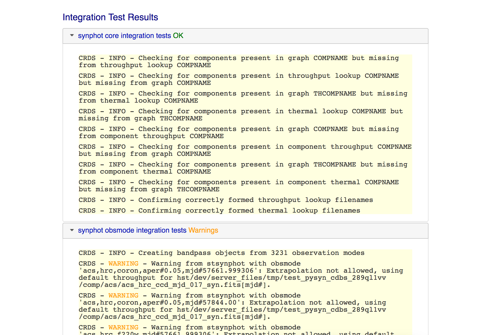

Before confirming a SYNPHOT submission, be sure to also check the integration
test results for warnings.

Submit Mappings
...............

*Submit Mappings* provides a basic interface for submitting a list of mapping
files which don't have to be related.   This can be used to submit context files
which refer to files from *Submit References* and with fewer restrictions on
allowable changes.   Typically only .rmaps are submitted this way.   Mappings
submitted this way must also pass through crds.certify.

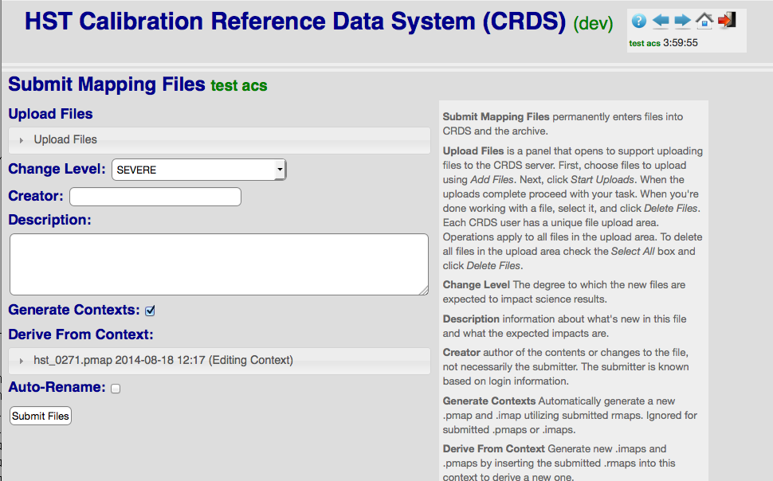

Mapping Change Procedure
++++++++++++++++++++++++

The manual rmap update process is to:

1.  Download the starting rmap from the web site or copy it out of
    `/grp/crds/cache/mappings/hst`, `/grp/crds/cache/mappings/jwst`
    or `/grp/crds/cache/mappings/roman`.

2.  **DO NOT** change the name of the mapping
    **DO NOT** alter the internal name links like *derived_from* in the mapping
    header.   Leave the naming properties exactly as-is.

3.  Modify the mapping in any text editor and verify the mapping as best you
    can.  Use great care, CRDS certify cannot check many of the mapping properties.

4. Run crds.certify on the resulting mapping, using the current edit context as
   the point of comparison:

     .. code-block:: bash

         $ crds certify ./jwst_miri_dark_0004.rmap  --comparison-context jwst-edit

   You may see an rmap checksum warning since you modified the contents of
   the rmap.

   Note: the `./` seen in the example command is important,  it tells CRDS to
   use the file in the current directory instead of attempting to find it in
   the CRDS cache.

   Run crds.checksum on the mapping to update the internal sha1sum if you wish
   to load the context into Python to do other tests with the .rmap:

     .. code-block:: bash

         $ crds checksum ./jwst_miri_dark_0004.rmap

   The internal checksum is also used to verify the upload integrity when you
   finally submit the file to CRDS.  An out-of-date checksum or corrupted file
   will generate a warning.

6. Typically for rmaps set::

   * Generate Contexts ON
   * Auto-Rename ON

**NOTE:** See also `Delete References`_ and `Add References`_ for streamlined
methods of adding and removing existing references to/from rmaps.

Imap and Pmap Differences
+++++++++++++++++++++++++

Note that submissions of imaps and pmaps do not support Generate Context.

In addition, CRDS doesn't accept files that refer to other files not already in
CRDS.  This means that pmaps and new imaps they refer to cannot be handled in
one submission.

The general practice of not manually modifying CRDS mapping name properties
holds for imaps and pmaps as well: it's better to leave filenames unchanged,
and header naming properties unchanged, and let CRDS do Auto-rename and related
header updates.

Hence, it is recommended to do imap and pmap work in two phases: First, modify
and submit the imaps, generating and/or reserving official CRDS names.  Next
manually modify the pmap as needed to refer to the newly generated imap names.

New .pmaps not created by CRDS require manually updating the Editing Context
using Set Context.

Manual .imap update
!!!!!!!!!!!!!!!!!!!

1. Identify the baseline context to derive from.

2. Within that .pmap,  identify the .imap to modify.

3. Download or copy the identified .imap.

4. Manually edit the .imap to make your required changes, e.g. removing a
type or setting a type to `N/A`.   Note that adding types can generally be
done just by submitting the new .rmap normally.

5. Submit the .imap using Submit Mappings with:

  * Generate Contexts OFF
  * Auto-rename ON

6. Confirm your submission

7. Follow the procedure for manually updating a .pmap to refer to
your newly named .imap

Manual .pmap update
!!!!!!!!!!!!!!!!!!!

1. Download or copy the .pmap you wish to start from.

2. Manually edit the .pmap to make any required changes.

3. Submit the .pmap using Submit Mappings with:

  * Generate Contexts OFF
  * Auto-rename ON

4. Confirm your submission.

5. From here onward,  this should be a normal file submission,  with
corresponding processes to archive the files,  Set Context the default
OPERATIONAL context,  and sync the pipeline's CRDS cache.

6. Use Set Context to update the **EDIT context** to this .pmap
as the default starting point for subsequent file submissions.

Manually update the EDIT context
!!!!!!!!!!!!!!!!!!!!!!!!!!!!!!!!

The default starting point for new rules `Derive From Context` is defined by
the Editing Context.

When Generate Contexts is ON,  CRDS automatically sets the Editing
Context to the generated .pmap.

When Generate Contexts is OFF and a .pmap is manually updated, the Set Context
page should generally be used to update the Editing Context so that future
submissions will derive from the new .pmap by default.

The Set Context page can be used to update either the Operational or Editing
Context.  When updating the Editing Context, you may need to open the context
selection accordion and type in the name of the new .pmap in User Specified.
Verify that the correct .pmap is being set.

Submit References
.................

*Submit References* provides a lower level interface for submitting a list of
references.   No mappings are generated to refer to the submitted files.
Submitted references must still pass through crds.certify.

.. figure:: images/web_submit_references.png
   :scale: 50 %
   :alt: create contexts inputs

References submitted in this manner are archived normally but without
corresponding .rmap updates are essentially orphans.  If intended for automatic
use similar to normal reference files, there's an expectation that some other
form of .rmap update will be performed to add these references to a context.

Mark Files Bad
..............

*Mark Files Bad* supports marking a file as scientifically invalid and
also supports reversing the decision and marking it good once more.

The CRDS procedure for marking files bad requires three steps:

1. Create a clean context which does not contain any prospective bad files.
2. Make the clean context operational using Set Context.
3. Mark the prospective bad files actually bad using Mark Bad Files.

This procedure maintains the invariant that the operational pipeline context
contains no known bad files.  The designation as bad files does not take effect
until the pipeline CRDS cache is synchronized with the server.

Creating a clean context can be done in arbitrary ways,  but the two most
common ways will likely be:

1. Submit replacement files for the bad files to create a clean context.
2. Use Delete References to generate a new context without the bad files.

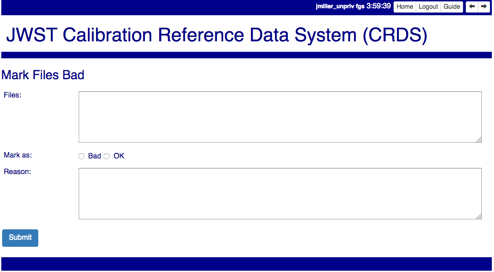

Marking a rules file (mapping) as bad implicitly marks all the files
which refer to it as bad.  Hence,  marking a .rmap as bad will make
any .imap which refers to it bad as well,  and will also taint all .pmaps
which refer to the bad .imaps.   Whenever a rules file is marked bad,
it becomes an error to use the containing context.

Marking a reference file as bad only invalidates that reference in every
context that includes it.  An error is issued for a bad reference only when
it is actually recommended by CRDS,  it is not an error to use the containing
context.

By default, bestrefs assignment of bad references or use of bad rules are errors.
The default command line behavior can be overridden by setting environment variables:
*CRDS_ALLOW_BAD_RULES* and/or *CRDS_ALLOW_BAD_REFERENCES*.

.. _`Delete References`:

Delete References
.................

*Delete References* supports supports removing references (but not rules) from
a context generating a new context.  Delete References provides one
straightforward way to generate clean rules prior to marking the deleted files
as bad.

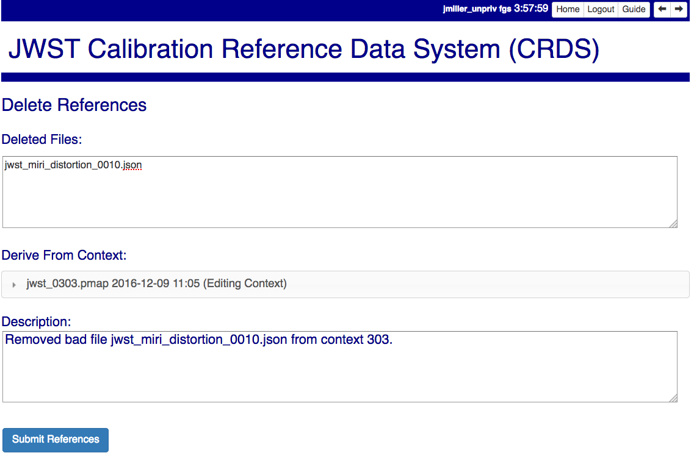

Delete References does not remove the files from CRDS, it only removes them
from the specified set of rules.  The references remain available under any
contexts which still refer to them.

Files are specified for Delete References by listing their names in the Deleted
Files field of the input form, separated by spaces, commas, and/or newlines.

Changes to rules which result from delete references are presented on a results
page which must be confirmed or cancelled as with other file submissions.

.. _`Add References`:

Add References
..............

*Add References* supports adding existing CRDS references to a CRDS context
which does not contain them already.  Add References is the inverse of Delete
References and generates new CRDS rules without requiring the re-submission of
files to CRDS.

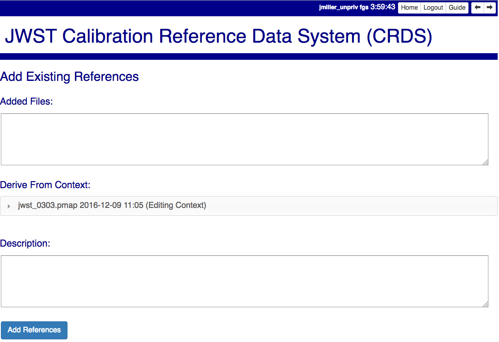

Add references can be used to undo the effects of Delete References in a
perhaps distant descendant context containing other changes.  Add references
can also be used to add tested references from a branched context into the
current operational context.

Files are specified for Add References by listing their names in the Added
Files field of the input form, separated by spaces, commas, and/or newlines.

Changes to rules which result from add references are presented on a results
page which must be confirmed or cancelled as with other file submissions.
Rules changes from add references should be carefully reviewed to ensure that
the resulting rmap update is as intended.

In particular, other rmap differences from a branched context are not added,
so additional test parameters or other header and structural changes of any
test rmap are not carried over by Add References,  only the reference files
themselves.

Certify Files
.............

*Certify File* runs crds.certify on the files in the ingest directory.

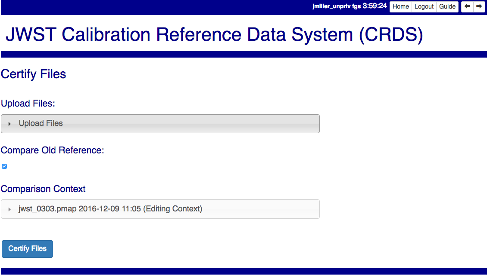

If the certified file is a reference table,  the specified context is used to
locate a comparison file.

Submission Warnings and Errors
..............................

This section discusses some of the more common errors and warnings associated
with CRDS file submissions.  While CRDS does its best to trap and reject common
errors, CRDS error checking is not a substitute for testing reference files in
actual calibrations and verifying that they work.

**NOTE:** don't hesitate to ask for clarifications or changes if you find CRDS
checks confusing or counterproductive.

Identical Files
+++++++++++++++

CRDS detects if submitted files are bit-for-bit-identical to existing files or
each other by comparing their sha1sums::

   CRDS - ERROR - In 'jwst_miri_dark_0057_b.fits' : Duplicate file check : File 'jwst_miri_dark_0057_b.fits' is identical to existing CRDS file 'jwst_miri_dark_0057.fits'

CRDS rejects identical files since there is a likelihood that the wrong files
have been delivered by mistake.

**SOLUTION:** Remove the duplicate files from your submission and re-submit.
Rather than re-uploading your entire submission, you have the option to log
into the webite and remove duplicates from the upload area before proceeding
with the remainder of the submission form.  You can also upload missing or
replacement files,  then fill out the remainder of the form and submit.

Certification Errors and Warnings
+++++++++++++++++++++++++++++++++

CRDS has a certification process that is used to check incoming reference and
rules files.  The certify program applies several kinds of checks which can
result in warnings or errors on the website.  (The certify program is also
installed with the CRDS client and can be run locally by itself or embedded in
other file submission toolchains.  See command line tools.)

Internal CRDS Constraints
!!!!!!!!!!!!!!!!!!!!!!!!!

CRDS defines constraints of its own using specifications called .tpn files
described in detail here: :ref:`header-certify-constraints`.  These
specifications and checks can be reviewed on the website by looking up the
details of any particular reference file of the same instrument and type:

..:

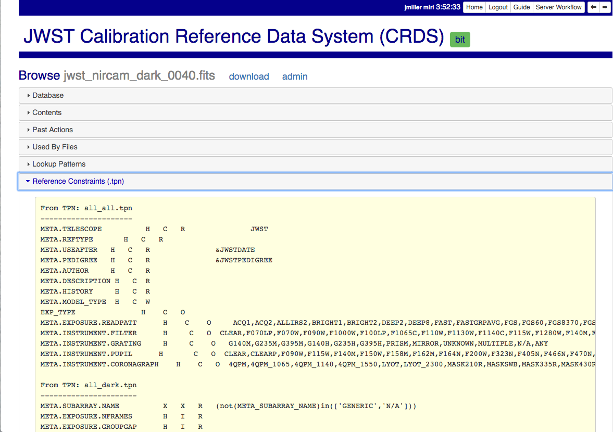

These checks are independent of the JWST datamodels discussed below.

JWST and Roman Data Model Constraints
!!!!!!!!!!!!!!!!!!!!!!!!!!!!!!!!!!!!!

.. tabs::

   .. group-tab:: JWST

       The JWST calibration software (CAL) models the structure and valid keyword 
       values for reference files in its jwst.datamodels package.  See `JWST CAL Documentation`_ 
       for more information.
       
       Effectively, the CAL datamodels define a formatting contract your references 
       need to fulfill.  Files which don't fulfill this contract will generally either
       result in perpetual warnings or outright pipeline failures.
       
       *Crds certify* invokes datamodels.open() to verify datamodels compliance for
       your reference files.

       This message:

         .. code-block:: bash

             CRDS - WARNING - Missing suggested keyword 'META.MODEL_TYPE [DATAMODL]'

       indicates that the JWST CAL Data Models were not used to create your reference files.  
       `Datamodels.open()` needs the DATAMODL keyword to define the correct model to validate your file.

       This message:

         .. code-block:: bash

             CRDS - WARNING - NoTypeWarning : jwst.datamodels.util : model_type not found. 
             Opening .../jwst_miri_specwcs_lrscdp7.fits as a ReferenceFileModel
      
       resulted from a reference file that used an invalid value for `DATAMODL`.
       You have the option of ignoring these warnings, but CRDS is probably not using 
       the most appropriate model to validate your file, only a more generic model.
       When your file is later processed by the CAL software, CAL will use the correct
       model and may reject your file.

       **SOLUTION:** The best solution is to use the CAL datamodels and methods
       recommended by the CAL s/w team to create your reference files.  This will
       automatically set DATAMODL and can pre-validate your reference files at the
       same time you create them.  While this won't catch everything,  its superior
       to CRDS catching errors later.   Better yet,  running your files through actual
       test calibrations may reveal problems no constraints catch.

   .. group-tab:: ROMAN

       The Roman pipeline software `romancal` models the structure and valid keyword 
       values for reference files.  See `Roman Cal Documentation`_ 
       for more information.
       
       Effectively, the Roman datamodels package defines a formatting contract your references 
       need to fulfill.  Files which don't fulfill this contract will generally either
       result in perpetual warnings or outright pipeline failures.
       
       *Crds certify* invokes `roman_datamodels.datamodels.open()` to verify datamodels compliance for
       your reference files.

Fitsverify Failures
!!!!!!!!!!!!!!!!!!!

For FITS files, as part of certification CRDS normally runs HEASARC's
fitsverify program to verify that file formats are broadly compliant and should
work with cfitsio as well as astropy.

1. Checksum errors

   CRDS classifies FITS checksum errors detected by fitsverify as errors::

     CRDS - ERROR -  >> RECATEGORIZED *** Warning: Data checksum is not consistent with  the DATASUM keyword
     CRDS - ERROR -  >> RECATEGORIZED *** Warning: HDU checksum is not in agreement with CHECKSUM.

   CRDS leaves Astropy checksum warnings alone::

     CRDS - WARNING -  AstropyUserWarning : astropy.io.fits.hdu.base : Checksum verification failed for HDU ('', 1).
     CRDS - WARNING -  AstropyUserWarning : astropy.io.fits.hdu.base : Datasum verification failed for HDU ('', 1).

   Checksums are not required, but if you do define them they should be correct
   so that file users are not bombarded with warnings from FITS libraries.
   Hence,  the CRDS server rejects files with bad checksums based on the errors
   defined for fitsverify.

   **SOLUTION 1:** Use your FITS s/w or *crds checksum* to update your CHECKSUM
    and DATASUM keywords::

     $ crds checksum *.fits

   **SOLUTION 2:** Use crds checksum or your FITS s/w to remove CHECKSUM and
   DATASUM keywords::

     $ crds checksum --remove *.fits

2. Other fitsverify anomalies

   fitsverify can detect other anomalies such as file truncation.

   By default warnings are merely echoed but errors will lead to the rejection
   of your files.

   On request, CRDS can be modified to reclassify fitsverify messages as
   warnings, errors, etc.

Table Checks
++++++++++++

Optionally CRDS certify attempts to detect errors in table updates by loosely
characterizing unique table rows.  This check is configured in the CRDS client
as part of the type specification for the table by setting the
"unique_row_keys" parameter in the spec.  This parameter defines table columns
which should define combinations which appear in the table only once.  CRDS
does not verify that all combinations are present.  CRDS verifies that
combinations which were present in an old table version are present in the new
version.

Table checking consists of four stages:

  1. Identifying a comparison reference file
  2. Identifying unique mode rows
  3. Checking for duplicate rows
  4. Checking for deleted rows in the new version of the table

Each instrument + reference type combination can potentially define different
"mode columns" in its type specification.

No Comparison Reference Warning
!!!!!!!!!!!!!!!!!!!!!!!!!!!!!!!

When a --comparison-context is specified, CRDS searches the context for a
reference file which the new table would replace.  When CRDS cannnot find a
suitable comparison table, CRDS issues a warning like::

    CRDS - WARNING - No comparison reference for 'test_jwst_nircam_photom_0039.fits' in context 'jwst_0503.pmap'. Skipping tables comparison.

to let you know that table checks are not being performed.  If it's expected
that some comparison table should exist, further investigation is warranted but
not required.  If this is a new table or inexact replacement (e.g. subsequent
USEAFTER date), the warning can be ignored.

Error Opening Comparison Reference
!!!!!!!!!!!!!!!!!!!!!!!!!!!!!!!!!!

Idenifying a comparison reference file by consulting the comparison context is
just the first step.  To perform table checks, crds certify needs direct
access to the comparison reference as a readable file.

The CRDS servers and users using `/grp/crds/cache` should never see this problem
because all reference files should be available for comparison.  Users
utilizing a personal CRDS cache e.g. defined by CRDS_PATH may see this problem
and can download missing comparison references by specifying --sync-files to
crds certify.

Selection of Mode Columns
!!!!!!!!!!!!!!!!!!!!!!!!!

CRDS define table modes using the intersection of columns specified in the
type's specification and columns available in the table::

    CRDS - INFO -  FITS file 'y951738kl_hv.fits' conforms to FITS standards.
    CRDS - INFO -  Comparing reference 'y951738kl_hv.fits' against 'yas2005el_hv.fits'
    CRDS - INFO -  Mode columns defined by spec for old reference 'yas2005el_hv.fits[1]' are: ['DATE']
    CRDS - INFO -  All column names for this table old reference 'yas2005el_hv.fits[1]' are: ['DATE', 'HVLEVELA']
    CRDS - INFO -  Checking for duplicate modes using intersection ['DATE']

In this hypothetical example, CRDS will check that no value of DATE appears
more than once, and every value of DATE appearing in the old version of the
table appears in the new version of the table.

Note that the intersection can vary if e.g. columns in a table vary by FITS
HDU; there is no expectation that every mode column mentioned in the CRDS
type specification are in every HDU.

Duplicate Mode Rows Warning
!!!!!!!!!!!!!!!!!!!!!!!!!!!

To meet the ultimate goal of detecting accidentally dropped table modes, CRDS
first tries to characterize mode rows as unique using the selected mode
parameters.  This lets CRDS define the set of modes represented in any
particular table.

If as part of defining this set CRDS notices that there are multiple copies of
a parameter combination which should be unique, CRDS will issue a warning::

    CRDS - WARNING -  Duplicate definitions in old reference 'y9j16159l_hv.fits[2]' for mode: (('DATE', 56924.0417),) :
     (129, (('DATE', 56924.0417), ('HVLEVELB', 169)))
    (131, (('DATE', 56924.0417), ('HVLEVELB', 169)))

In this hypothetical case, both row 129 and row 131 have the DATE value
56924.0417.  Based on the type specification,  CRDS has defined this as
something unexpected.  If on review it is determined that the duplicate rows
are innocuous or expected, this warning can be ignored.

Missing Mode Rows Warning
!!!!!!!!!!!!!!!!!!!!!!!!!

A warning is issued when a unique parameter combination from one table
is missing from the next version::

  CRDS - WARNING -  Table mode (('DATE', 56923.5834),) from old reference 'yas2005el_hv.fits[1]' is NOT IN new reference 'y951738kl_hv.fits[1]'
  CRDS - WARNING -  Table mode (('DATE', 56923.625),) from old reference 'yas2005el_hv.fits[1]' is NOT IN new reference 'y951738kl_hv.fits[1]'
  CRDS - WARNING -  Table mode (('DATE', 56964.0),) from old reference
  'yas2005el_hv.fits[1]' is NOT IN new reference 'y951738kl_hv.fits[1]'

If on review it is determined that these rows were dropped intentionally,
this warning can be ignored.

Rmap Update Errors
++++++++++++++++++

As part of a typical reference file submission, CRDS automatically adds new
files to the appropriate rmap and generates new context files.  New files are
added to the rmaps baed on the values of rmap-specific parameters pulled from
their headers.  This phase can detect some forms of errors which generally
need to be addressed,  even if they only appear as warnings.

Exact Matching Duplicates
!!!!!!!!!!!!!!!!!!!!!!!!!

Given the task of adding N reference files to an rmap, CRDS checks that N new
files appear in the new rmap.  Given two files with identical matching
parameter values, both files would occupy the same location in the .rmap, and
one file would replace the other. This is certainly an error so CRDS rejects
the file submission with a message like this::

    CRDS - ERROR -  ----------------------------------------
    Both 's7g1700gl_dead_dup2.fits' and 's7g1700gl_dead_dup1.fits' identically match case:
     ((('DETECTOR', 'FUV'),), (('DATE-OBS', '1996-10-01'), ('TIME-OBS', '00:00:00')))
    Each reference would replace the other in the rmap.

**SOLUTION 1:** Generally this means there was an error generating or handling
the reference files and the fix is to gather the correct set of files and
resubmit.

**SOLUTION 2:** CRDS may view two files which are truly different as "the same"
because the CRDS rmap is not using the correct matching parameters to
differentiate between them.  In that case the fix may be to add or change the
keywords CRDS is using to select reference files of this type, i.e. the rmap's
parkey header value.  This fix entails modifying the existing rmap to
define a new matching keywords,  and updating the match cases of any existing
reference files to correspond to the new keywords.   The revised rmap is then
delivered using *Submit Mappings*,  and the original submission is then
repeated relative to the new rmap.

**NOTE:** It is possible for new reference files to have different sha1sums,
i.e. not be bit-for-bit-identical, but also to use exactly the same CRDS
matching criteria and be considered to be "duplicates" from a matching
perspective.

Equal Weight Match Cases
!!!!!!!!!!!!!!!!!!!!!!!!

When adding files which are characterized as "similar but different", or in
cases where special values like GENERIC and N/A are being used, CRDS can
issue a WARNING like this::

    CRDS - WARNING -  ----------------------------------------
    Match case
     (('DETECTOR', 'FUV'),)
    is an equal weight special case of
     (('DETECTOR', 'FUV|NUV'),)
    For some parameter sets, CRDS interprets both matches as equally good.

This section explains the related issues and what to do.

Weighted Matching
^^^^^^^^^^^^^^^^^
CRDS uses a weighted matching scheme to assign reference files.   Every
reference type's rmap has a set of parameters which is used to categorize
files and how to apply them,  the *parkey* list/tuple defined in the rmap's
header.

CRDS uses a process of elimination for matching.  Each parameter is used to
eliminate categories of reference files which can't match.  After running
through all matching parameters, ideally only one category remains, the right
one.  It's possible however for multiple categories to survive the process of
elimination; in this case, CRDS uses "match weight" to choose the best.

During matching, each rmap parameter value will have one of 3 consequences when
compared to the corresponding dataset value:

1. The parameter value will definitively break the match and rule out the
   category completely.
2. The parameter will match and add a value of one to the match weight.
3. Some values (N/A or GENERIC) neither break the match nor add weight,
   they are counted as zero.

For the hypothetical warning shown earlier, there is an existing category which
matches on DETECTOR=FUV.  There is a new category which matches on either FUV
or NUV.  For a dataset with DETECTOR=FUV, either category would match with a
weight of "one".  Since the weights are both one, to CRDS they are equally good
matches.

In general rmaps use 2-3 matching parameters making analysis more complex.

Problems with Equal Weight Matches
^^^^^^^^^^^^^^^^^^^^^^^^^^^^^^^^^^
There are a number of problems with searches which result in multiple
Match() solutions:

1. Human beings reviewing the CRDS reference files, e.g. on the website, will
   expect one and only one category to match.  Hence they are likely to find
   the first, and overlook any others.

2. CRDS matching does not generally stop with the Match() category.  The
   Match() normally determines a list of files from which a reference is
   selected using USEAFTER and the observation date of the data.  This means
   that searching two categories involves shuffling them together in sorted
   order.  This is really impossible to visualize.

3. Related but disjoint categories of reference files are unlikely, it's more
   probable that a category is describing too many or too few parameter
   combinations.  The root idea is that future file organizations, future
   categories, should match past categories.  Or perhaps conversely, past
   categories should be expanded to match new categories.

Solution for Equal Weight Matches
^^^^^^^^^^^^^^^^^^^^^^^^^^^^^^^^^

Equal weight match cases are reported as errors. Cancel the submission and 
regenerate the reference files with different parameter values which coincide 
with an existing category. 

Note: this used to be reported as a warning in order to give latitude in 
addressing the problem (i.e. accept the submission but immediately edit the rmap 
to combine overlapping Match() categories). Starting in CRDS 11.16.7 this is now 
an error and the submission must be canceled.

Why CRDS Categorizes Files
^^^^^^^^^^^^^^^^^^^^^^^^^^

CRDS rmaps *create* categories which are expected to be a taxonomy.

Looking at an excerpt of the ACS DARKFILE rmap,  organization is good::

      DETECTOR  CCDAMP              CCDGAIN

      ('HRC', 'A|ABCD|AD|B|BC|C|D', '1.0|2.0|4.0|8.0') : UseAfter({
        '1992-01-01 00:00:00' : 'lcb12060j_drk.fits',
        '2002-03-01 00:00:00' : 'n3o1022cj_drk.fits',
        '2002-03-18 00:00:00' : 'n3o1022ej_drk.fits',
        '2002-03-19 00:34:31' : 'n3o1022fj_drk.fits',
        '2002-03-20 00:34:32' : 'n3o1022hj_drk.fits',
        ...

The meaning of the Match case above is that each file supports every
combination of the DETECTOR, 7 values of CCDAMP, and 4 values of CCDGAIN
for a total of 28 discrete parameter combinations.

These categories can be arbitrarily complex and vary for each rmap.

Browse Submission History
.........................

To browse previous submissions, follow the *Submission History* link on the
home page.  The initial form offers options for filtering by instrument,
submission date, etc:

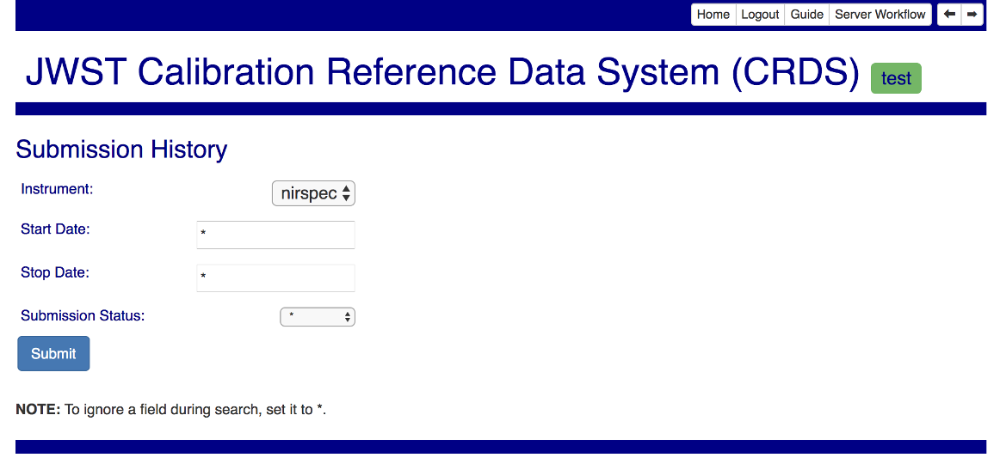

Use the special value * to disable a given filter.

Submitting the filter form will yield a summary list of relevant submissions:

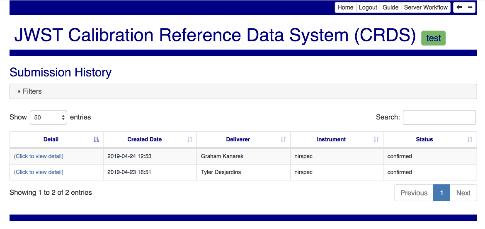

The link in the leftmost column leads to a detailed view of the submission
fields:

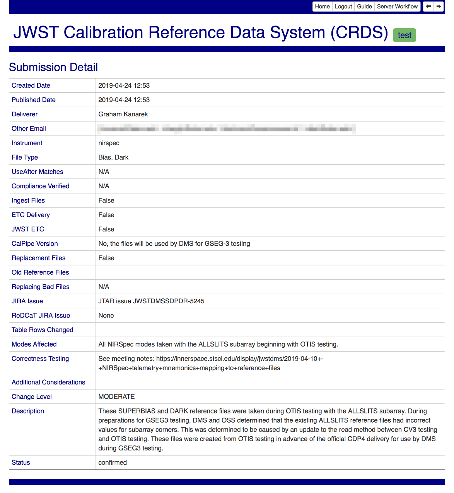
