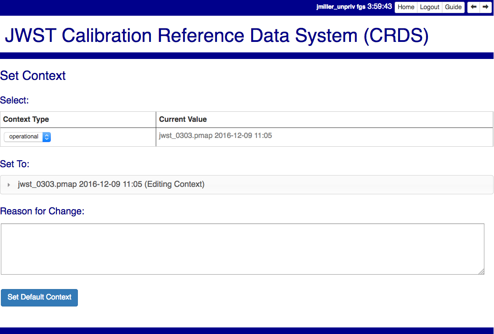

Pipeline Management
===================

This section discusses CRDS activities relevant to DMS pipeline operators.

Authenticated users can find more information about these processes by clicking
on the *Server Workflow* button in the top right corner of the website.

Operator Overview
.................

When new reference files are delivered,  CRDS requires the following DMS
operator work flow:

Run DMS CRDS poller
+++++++++++++++++++

The DMS operator runs the "CRDS poller" to copy files from a CRDS server
delivery directory into the archive.  While CRDS does prepare the delivery
directory for the file submission, most of this step is outside the scope of
CRDS-proper and done by the DMS/archive operators and systems to archive
CRDS-related files.

Wait for INS Checkout
+++++++++++++++++++++

Once new CRDS files are archived, INS is given the chance to preview files
exactly as they will run in the pipeline by calibrating relative to the CRDS
"edit" context.  Once archived, files in the *edit* context are fully available
but not yet in active use in the pipeline.  At this stage the DMS operator is
waiting for authorization to update CRDS and the pipeline.

Set (Default CRDS) Context
++++++++++++++++++++++++++

When an instrument team is satisfied that new references are working as
intended within CRDS, they request a DMS operator to update the default /
"operational" CRDS context by using the CRDS server *Set Context* page
described below.  This step establishes the specified context as the default
used by the pipeline as well as by other end-users who sync to the CRDS server
and do not explicitly override it.

Set Context
!!!!!!!!!!!

This section describes the website page used by operators to update the default
CRDS context.

*Set Context* enables setting the operational, edit, and versions contexts.  

CRDS enables contexts to be distributed before their adoption as the pipeline
default.  Set Context is used to select the default pipeline (operational)
context.
   
Setting the operational context changes state on the CRDS server which must be
subsequently sync'ed to remote pipelines and users.

Setting the *operational* context creates a new entry at the top of the Context
History.

Setting the *edit* context sets the default starting point for future file
submissions.

Setting the *versions* context defines the context used to locate the SYSTEM
CALVER reference file used to define calibration software component versions.

Sync Pipeline CRDS Cache
++++++++++++++++++++++++

The *crds_sync_cache.csh* script is run in the pipeline environment by an
operator, generally the same person who does *Set Context*.  This step
downloads new CRDS rules and reference files into a local CRDS cache used by
the pipeline to perform calibrations.  Once sync'ed, the pipeline runs in
complete isolation from the CRDS server and should not be subject to issues
related to new file deliveries or web site usage.

CRDS Server Repro Runs
++++++++++++++++++++++

When the operator updates the default CRDS context using *Set Context*, a CRDS
server cron job will notice and determine if any data should be reprocesssed.
When the cron job is complete, the CRDS server issues a descriptive e-mail to
crds_datamng@stsci.edu and makes the list of recommended dataset IDs available
for download by a CRDS web service.

Pipeline  Reprocessing Occurs
+++++++++++++++++++++++++++++

Pipeline operators run an "impact script" to access the CRDS web service
provided by CRDS repro, download the set of dataset IDs affected by reference
file changes, and initiate reprocessing of those datasets.

