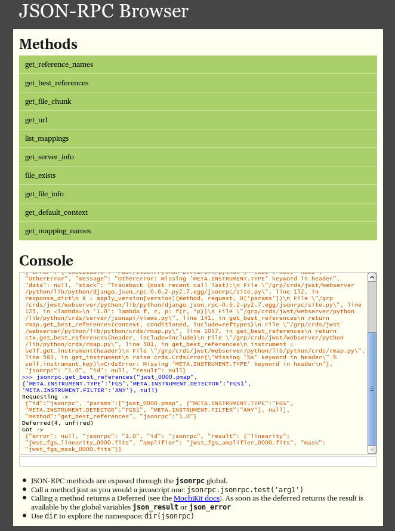

Web Services
============

The CRDS servers support a JSONRPC based service mechanism which enables 
remote users to make calls to the CRDS server without installing the CRDS
Python based client library. See http://json-rpc.org/wiki/specification
for more details on the JSONRPC protocol.

Users of the CRDS client library can access these JSONRPC functions using 
the crds.client module. Examples follow below.

Context Information
-------------------

The CRDS context is the version of CRDS rules used to select reference files.
The default CRDS context is maintained on the CRDS server and reported by
the function `get_default_context()`. Institutional pipelines which are operating
decoupled from the CRDS server can post their actual cached context to the CRDS
server for retrieval by `get_remote_context()`.

Centralized Default
+++++++++++++++++++

**get_default_context(observatory)**

`get_default_context()` returns the name of the context which is
currently in use by default in the archive pipeline, e.g. 'jwst_0001.pmap'.
This value is set and maintained on the CRDS Server. The actual pipeline context 
differs from this commanded valuer until the pipeline is synchronized with the CRDS
server using cron_sync.   

The commanded default can be obtained using the CRDS client library as follows:

.. tabs::

   .. group-tab:: HST

       .. code-block:: python

           >>> from crds import client
           >>> client.get_default_context('hst')
           'hst_1006.pmap'

   .. group-tab:: JWST

       .. code-block:: python

           >>> from crds import client
           >>> client.get_default_context('jwst')
           'jwst_0101.pmap'

   .. group-tab:: ROMAN

       .. code-block:: python

           >>> from crds import client
           >>> client.get_default_context('roman')
           'roman_0037.pmap'

See the explanation of JSONRPC requests and responses below for a language and library 
neutral example of calling the same CRDS web service using the command line program "curl".

Pipeline Echo
+++++++++++++

**get_remote_context(observatory, pipeline_name)**

`get_remote_context()` returns the name of the context last reported as
synced by the specified *pipeline_name* (e.g. 'jwst-ops-pipeline').  This is
the value stored in a pipeline's CRDS cache and echoed back to the CRDS server
when the cache is synchronized.  Since this value is inapplicable if a pipeline
is run in "remote" mode computing best references on the CRDS Server, the
generally preferred value is from `get_default_context()` since it always
reflects the intended operational context regardless of the pipeline's CRDS
mode.   

The actual default context for a pipeline can be obtained as follows:

  .. code-block:: python

      >>> from crds import client
      >>> client.get_remote_context('jwst', 'jwst-ops-pipeline')
      'jwst_0101.pmap'
  
  
Context History
+++++++++++++++

CRDS makes the history of contexts which have been activated in the pipeline as
the operational context via the `get_context_history()` web service:

  .. code-block:: python

      >>> client.get_context_history("jwst")
      [('2012-09-06 00:00:00', 'jwst.pmap', 'Bootstrap mappings'),
      ('2012-09-27 00:00:00',
      'jwst_0000.pmap',
      'First rules and references from jwst_gentools stub development cloning.'),
      ('2013-04-13 00:00:00', 'jwst_0001.pmap', 'Linearity and dark files.'),
      ('2013-07-31 00:00:00', 'jwst_0002.pmap', 'Dark and Mask files.'),
      ('2013-09-04 00:00:00',
      'jwst_0003.pmap',
      'Absolute Calibration (photom) additions and replacements.'),
      ('2013-11-25 09:00:03', 'jwst_0005.pmap', 'set by system'),
      ('2014-03-19 10:51:19',
      'jwst_0012.pmap',
      'Updated for META.INSTRUMENT.TYPE switch to META.INSTRUMENT.NAME\r\nNew linearity files for all instruments\r\nNew saturation files and rmaps for all instruments'),
      
      ...

      ('2015-11-18 12:58:13',
      'jwst_0105.pmap',
      'Declared various EXP_TYPE as N/A for 15 WCS types for MIRI, NIRCAM, NIRSPEC. Replacement MIRI distortion references for ticket #238.')
      ]
    
Each entry in the context history is a list/tuple of form:  `(start_date, context, description)`.

Adjacent entries are consecutive, the start date of the one context is the end date of the previous context.

The context history is in first-to-last order and it is possible that the context will be regressed to a prior
version;  consequently,  there is no guarantee that context names will monotonically increase.  At times several
file submissions and created contexts are activated en masse via the last created context; consequently, there
is no guarantee that pmap serial numbers will increase or decrease by one.

File Information
----------------

The CRDS server maintains a catalog of basic metadata for the rules and reference
files managed by CRDS. Catalog information cab be 

Single File Metadata
++++++++++++++++++++

**get_file_info(pipeline_context, filename)**

Return a dictionary of CRDS catalog information about `filename`.  For instance:

  .. code-block:: python
    
      >>> from crds import client
      >>> client.get_file_info("jwst", "jwst_miri_flat_0023.fits")
      {'activation_date': '2014-09-25 18:30:27',
       'aperture': 'none',
       'blacklisted': 'false',
       'change_level': 'severe',
       'comment': 'cdp-2 from fm testing',
       'creator_name': 'jwst build 3 team',
       'deliverer_user': 'homer',
       'delivery_date': '2014-09-20 07:55:56',
       'derived_from': 'none',
       'description': 'all references from jwst build 3 delivery 2. update miri flats, fringes, straymasks, resets,  lastframes,     nirspec flat.',
       'filekind': 'flat',
       'instrument': 'miri',
       'name': 'jwst_miri_flat_0023.fits',
       'observatory': 'jwst',
       'pedigree': 'ground',
       'reference_file_type': 'flat',
       'rejected': 'false',
       'replaced_by_filename': '',
       'sha1sum': '3f0c92aae539cb67f8e8823cc6815130018948f7',
       'size': '10592640',
       'state': 'operational',
       'type': 'reference',
       'uploaded_as': 'jwst_miri_flat_0016.fits',
       'useafter_date': '2050-01-01 00:00:00'}

Multiple File Metadata
++++++++++++++++++++++

**get_file_info_map(observatory, files=None, fields=None)**

get_file_info_map() is a multi-file version of get_info_map() which returns
the information for several files with one call.  If `files` is not specified
then get_file_info_map() returns info for all files:

  .. code-block:: python

      >>> from crds import client
      >>> client.get_file_info_map("jwst")
      {'jwst.pmap': {'activation_date': '2012-07-31 00:00:00',
       'aperture': 'none',
       'blacklisted': 'false',
       'change_level': 'severe',
       'comment': 'none',
       'creator_name': 'todd miller',
       'deliverer_user': 'crds',
       'delivery_date': '2014-03-26 08:49:23',
       'derived_from': 'created by hand 07-31-2012',
       'description': 'initial mass file import',
       'filekind': '',
       'history': 'none',
       'instrument': '',
       'name': 'jwst.pmap',
       'observatory': 'jwst',
       'pedigree': '',
       'reference_file_type': '',
       'rejected': 'false',
       'replaced_by_filename': '',
       'sha1sum': 'caf080abe09236165885f383045c59e8957a80ce',
       'size': '392',
       'state': 'archived',
       'type': 'mapping',
       'uploaded_as': 'jwst.pmap',
       'useafter_date': '2012-07-31 00:00:00'},
       ...
       }

Returns the info:

  .. code-block:: python

      { filename : { info, ... }, ... } 

on `files` of `observatory`.

`fields` can be used to limit info returned to specified keys:

  .. code-block:: python
    
      ['activation_date', 'aperture', 'blacklisted', 'change_level', 'comment', 
      'creator_name', 'deliverer_user', 'delivery_date', 'derived_from', 'description', 
      'filekind', 'instrument', 'name', 'observatory', 'pedigree', 'reference_file_type', 
      'rejected', 'replaced_by_filename', 'sha1sum', 'size', 'state', 'type', 
      'uploaded_as', 'useafter_date']

If `fields` is not specified then `get_file_info_map()` returns all fields.

Best References
---------------

Single Header
+++++++++++++

**get_best_references(context, header, reftypes)**

`get_best_references()` matches a set of parameters `header`` against the lookup 
rules specified by the pipeline mapping `context`` to return a mapping of 
type names onto recommended reference file names.

A suitable `context`` string can be obtained from `get_default_context()` above, 
although any archived CRDS context file can be specified.   

The `header`` parameter of get_best_references is nominally a JSON object which 
maps CRDS parkey names onto dataset file header values.   CRDS parkey names can
be located by browsing reference mappings (.rmap's) and looking at the `parkey` 
header parameter of the rmap.

.. tabs::

   .. group-tab:: HST

      For HST,  GEIS or FITS header keyword names are supported. *reftypes* should be a json array of strings,  each naming a single desired reference type.  If reftypes is passed as null,  recommended references for all reference types are returned.   Reference types which are defined for an instrument but which are not applicable to the mode defined by *header* are returned with the value *NOT FOUND n/a*.

      Example JSON for *reftypes* might be:

        .. code-block:: python

            ["amplifier","mask"]

      Because **get_best_references** determines references for a list of types,  lookup errors are reported by setting the value of a reference type to "NOT FOUND " + error_message.   A value of "NOT FOUND n/a" indicates that CRDS determined that a particular reference type does not apply to the given parameter set.

   .. group-tab:: JWST

      For JWST,  the rmap parkeys (matching parameter names) are currently specified as JWST stpipe data model dotted identifiers.  Example JSON for the get_best_references `header` parameter for JWST is:

        .. code-block:: python

            {"meta.instrument.type":"fgs", 
             "meta.instrument.detector":"fgs1", 
             "meta.instrument.filter":"any"}

      It is also possible to use the equivalent FITS header keyword, as defined by the data model schema, to determine best references:

        .. code-block:: python

            {"instrume":"fgs", 
             "detector":"fgs1", 
             "filter":"any"}

   .. group-tab:: ROMAN

      For Roman, the rmap parkeys (matching parameter names) are currently specified as Roman Datamodels dotted identifiers.  Example JSON for the get_best_references `header` parameter for Roman is:

        .. code-block:: python

            {"roman.meta.exposure.type":"grism", 
             "roman.meta.instrument.detector":"wfi01", 
             "roman.meta.exposure.ma_table_number":"any"}

Multiple Headers
++++++++++++++++

**get_best_references_by_header_map(context, header_map, reftypes)**

This service is an adaptation of get_best_references() to support returning
best references for multiple datasets with a single service call.  All
parameters are as for get_best_references() with the modification that `header`
above is replaced with a mapping from multiple dataset ids to their
corresponding headers, i.e. `header_map`::
    
    { dataset_id : header, ... }

The return value is likewise adapted to return best references for multiple
datasets::

    { dataset_id : best_references, ... }

Where `dataset_id` is nominally an HST IPPPSSOOT id (e.g. 'I9ZF01010'), JWST or Roman
dataset identifier (TBD).  Since `dataset_id` is only a keyword not used in best
references computations, it can be any unique abstract identifier consisting of
alphanumeric characters, period, colon, hyphen, or plus sign of 128 characters
or less.

Selection Parameters
++++++++++++++++++++

**get_required_parkeys(context)**

Return a mapping from instruments to lists of parameter names required to
compute bestrefs under `context`,  i.e. matching header keys::

    { instrument : [ matching_parkey_name, ... ], ... }

In CRDS the matching parameters are defined by each set of rules, e.g. for 
one HST context `hst_0366.pmap` the reference file selection parameters 
for all instruments are as follows:

  .. code-block:: python

      {'acs': ['INSTRUME', 'APERTURE', 'ATODCORR', 'BIASCORR', 'CCDAMP', 'CCDCHIP',
           'CCDGAIN', 'CRCORR', 'DARKCORR', 'DATE-OBS', 'DETECTOR', 'DQICORR',
           'DRIZCORR', 'FILTER1', 'FILTER2', 'FLASHCUR', 'FLATCORR', 'FLSHCORR', 
           'FW1OFFST', 'FW2OFFST', 'FWSOFFST', 'GLINCORR', 'LTV1', 'LTV2', 'NAXIS1', 
           'NAXIS2', 'OBSTYPE', 'PCTECORR', 'PHOTCORR', 'REFTYPE', 'RPTCORR', 
           'SHADCORR', 'SHUTRPOS', 'TIME-OBS', 'XCORNER', 'YCORNER'], 
      'cos': ['INSTRUME', 'ALGNCORR', 'BADTCORR', 'BRSTCORR', 'DATE-OBS', 'DEADCORR',
          'DETECTOR', 'EXPTYPE', 'FLATCORR', 'FLUXCORR', 'LIFE_ADJ', 'OBSMODE', 'OBSTYPE', 
          'OPT_ELEM', 'REFTYPE', 'TDSCORR', 'TIME-OBS', 'TRCECORR', 'WALKCORR'], 
      'nicmos': ['INSTRUME', 'CAMERA', 'DATE-OBS', 'FILTER', 'NREAD', 'OBSMODE', 'READOUT', 
              'REFTYPE', 'SAMP_SEQ', 'TIME-OBS'], 
       'stis': ['INSTRUME', 'APERTURE', 'BINAXIS1', 'BINAXIS2', 'CCDAMP', 'CCDGAIN', 'CCDOFFST', 
            'CENWAVE', 'DATE-OBS', 'DETECTOR', 'OBSTYPE', 'OPT_ELEM', 'REFTYPE', 'TIME-OBS'], 
       'wfc3': ['INSTRUME', 'APERTURE', 'ATODCORR', 'BIASCORR', 'BINAXIS1', 'BINAXIS2', 'CCDAMP', 
            'CCDGAIN', 'CHINJECT', 'DARKCORR', 'DATE-OBS', 'DETECTOR', 'DQICORR', 'DRIZCORR', 
            'FILTER', 'FLASHCUR', 'FLATCORR', 'FLSHCORR', 'PHOTCORR', 'REFTYPE', 'SAMP_SEQ', 
            'SHUTRPOS', 'SUBARRAY', 'SUBTYPE', 'TIME-OBS'], 
       'wfpc2': ['INSTRUME', 'ATODGAIN', 'DATE-OBS', 'FILTER1', 'FILTER2', 'FILTNAM1', 'FILTNAM2', 
              'IMAGETYP', 'LRFWAVE', 'MODE', 'REFTYPE', 'SERIALS', 'SHUTTER', 'TIME-OBS']
      }

The required parkeys can be used to reduce a complete file header to only those keywords
necessary to select references under the given context.

Valid Dataset IDs
+++++++++++++++++

**get_dataset_ids(context, instrument)**

CRDS interacts with the archive to obtain matching parameters to compute
best references for particular datasets.  Each parameter set corresponds to a
dataset ID.  A list of the valid dataset IDs with respect to a particular CRDS
context (or date) can be obtained as follows.

To obtain current best references, specify the context using a date:

.. tabs::

   .. group-tab:: JWST

       .. code-block:: python

           >>> get_dataset_ids("2016-01-01T00:00:00", "miri")
           ['JW80500017001_02101_00001.MIRIFUSHORT:JW80500017001_02101_00001.MIRIFUSHORT',
           'J80500020001_02101_00001.MIRIFUSHORT:JW80500020001_02101_00001.MIRIFUSHORT',
           'JW80500018001_02101_00001.MIRIFUSHORT:JW80500018001_02101_00001.MIRIFUSHORT',
           'JW80500020001_02101_00001.MIRIFULONG:JW80500020001_02101_00001.MIRIFULONG',
           'JW80500018001_02101_00002.MIRIFULONG:JW80500018001_02101_00002.MIRIFULONG',
           'JW80500009001_02101_00001.MIRIMAGE:JW80500009001_02101_00001.MIRIMAGE',
           'JW80500018001_02101_00001.MIRIFULONG:JW80500018001_02101_00001.MIRIFULONG',
           'JW80500018001_02101_00002.MIRIFUSHORT:JW80500018001_02101_00002.MIRIFUSHORT',
           'JW80500003001_02101_00001.MIRIMAGE:JW80500003001_02101_00001.MIRIMAGE',
           'JW80500018001_02101_00003.MIRIFUSHORT:JW80500018001_02101_00003.MIRIFUSHORT']

   .. group-tab:: ROMAN

       .. code-block:: python

           >>> get_dataset_ids("2022-01-01T00:00:00", "wfi")
           ['R0000201001001001002_01101_0001_WFI01:R0000201001001001002_01101_0001_WFI01',
           'R0000101001001001001_01101_0001_WFI01:R0000101001001001001_01101_0001_WFI01',
           'R0000101001001001001_01101_0001_WFI16:R0000101001001001001_01101_0001_WFI16',
           'R0000201001001001003_01101_0001_WFI01':'R0000201001001001003_01101_0001_WFI01']

Alternately, the abstract default context can be specified as "<project>-operational", as in:

.. tabs::

   .. group-tab:: JWST

       .. code-block:: python

           >>> get_dataset_ids("jwst-operational", "miri")
           ['JW80500017001_02101_00001.MIRIFUSHORT:JW80500017001_02101_00001.MIRIFUSHORT',
           'J80500020001_02101_00001.MIRIFUSHORT:JW80500020001_02101_00001.MIRIFUSHORT',
           'JW80500018001_02101_00001.MIRIFUSHORT:JW80500018001_02101_00001.MIRIFUSHORT',
           'JW80500020001_02101_00001.MIRIFULONG:JW80500020001_02101_00001.MIRIFULONG',
           'JW80500018001_02101_00002.MIRIFULONG:JW80500018001_02101_00002.MIRIFULONG',
           'JW80500009001_02101_00001.MIRIMAGE:JW80500009001_02101_00001.MIRIMAGE',
           'JW80500018001_02101_00001.MIRIFULONG:JW80500018001_02101_00001.MIRIFULONG',
           'JW80500018001_02101_00002.MIRIFUSHORT:JW80500018001_02101_00002.MIRIFUSHORT',
           'JW80500003001_02101_00001.MIRIMAGE:JW80500003001_02101_00001.MIRIMAGE',
           'JW80500018001_02101_00003.MIRIFUSHORT:JW80500018001_02101_00003.MIRIFUSHORT']

   .. group-tab:: ROMAN

       .. code-block:: python

           >>> get_dataset_ids("2022-01-01T00:00:00", "wfi")
           ['R0000201001001001002_01101_0001_WFI01:R0000201001001001002_01101_0001_WFI01',
           'R0000101001001001001_01101_0001_WFI01:R0000101001001001001_01101_0001_WFI01',
           'R0000101001001001001_01101_0001_WFI16:R0000101001001001001_01101_0001_WFI16',
           'R0000201001001001003_01101_0001_WFI01':'R0000201001001001003_01101_0001_WFI01']

Dataset IDs use a specific grammar depending on the mission:

.. tabs::

   .. group-tab:: HST

      For HST requesting parameters using only the <product_id> returns the parameters associated with the full two part ID for every exposure of the product.  Requesting the parameters using only the <exposure_id> returns the references associated with processing that exposure.

        .. code-block:: python

            <product_id> : <exposure_id>

      It's possible to specify either half of an ID returned by `get_dataset_ids()` to request matching parameters or best references using the services below.

   .. group-tab:: JWST

      As can be seen below, currently JWST IDs are redundant and <whole> and <part> are identical.  However, conceptually the IDs have that relationship and may be further elaborated and differentiated in later builds (post-jwst-build-7).  In such a case, several exposure level IDs (<parts>'s) might have an identical common root (<whole>).

        .. code-block:: python

            <id>     :=  <whole>:<part>
            <whole>  :=  <filesetname>:<detector>
            <part>   :=  <filesetname>:<detector>

      It's possible to specify either half of an ID returned by `get_dataset_ids()` to request matching parameters or best references using the services below. For JWST, conceptually the same behavior as HST will be preserved, so while either half of an ID will currently return the same parameters, at a future date the <whole> part may return all references associated with all exposures of a single high level product, and the <part> component will only return the references associated with processing that particular exposure.

   .. group-tab:: ROMAN

      As can be seen below, currently Roman IDs are redundant and <whole> and <part> are identical.  However, conceptually the IDs have that relationship and may be further elaborated and differentiated in later builds.  In such a case, several exposure level IDs (<parts>'s) might have an identical common root (<whole>).

        .. code-block:: python

            <id>     :=  <whole>:<part>
            <whole>  :=  <filesetname>:<detector>
            <part>   :=  <filesetname>:<detector>

      It's possible to specify either half of an ID returned by `get_dataset_ids()` to request matching parameters or best references using the services below. For Roman, conceptually the same behavior as HST will be preserved, so while either half of an ID will currently return the same parameters, at a future date the <whole> part may return all references associated with all exposures of a single high level product, and the <part> component will only return the references associated with processing that particular exposure.

Matching Parameters By ID
+++++++++++++++++++++++++

**get_dataset_headers_by_id(context_specifier, ids, datasets_since)**

CRDS fetches best reference matching parameters indirectly from the archive database.
The `get_dataset_headers_by_id()` function can be used to return the parameters required
to compute best references associated with the specified dataset ids:

*context_specifier* is a date-based CRDS context specifier,  e.g.:  jwst_0192.pmap, 2015-05-25T00:00:27, jwst-operational

*ids* is a list of archive dataset id strings as shown above.   A maximum of 200 IDs should be requested per call.

*datasets_since* is an optional cut-off date for datasets.  If specified, only datasets acquired after that date are returned.

An example call using the CRDS Python client is:

.. tabs::

   .. group-tab:: JWST
    
       .. code-block:: python
          
           >>> get_dataset_headers_by_id("2016-01-01", ['JW96090001004_03101_00001.NRCB2'], None)
           {'JW96090001004_03101_00001.NRCB2': {
               'META.EXPOSURE.READPATT': 'BRIGHT1',
               'META.EXPOSURE.TYPE': 'NRC_IMAGE',
               'META.INSTRUMENT.CHANNEL': 'SHORT',
               'META.INSTRUMENT.DETECTOR': 'NRCB2',
               'META.INSTRUMENT.FILTER': 'F150W2',
               'META.INSTRUMENT.NAME': 'NIRCAM',
               'META.INSTRUMENT.PUPIL': 'CLEAR',
               'META.SUBARRAY.NAME': 'FULL'
               }
           }

   .. group-tab:: ROMAN

       .. code-block:: python

           >>> get_dataset_headers_by_id("2021-09-01", ['r0000201001001001002_01101_0001_WFI01'], None)
           {'R0000201001001001002_01101_0001_WFI01': {
               "ROMAN.META.INSTRUMENT.NAME": "WFI", 
               "ROMAN.META.INSTRUMENT.DETECTOR": "WFI01", 
               "ROMAN.META.INSTRUMENT.OPTICAL_ELEMENT": "GRISM", 
               "ROMAN.META.EXPOSURE.MA_TABLE_NUMBER": 1, 
               "ROMAN.META.EXPOSURE.TYPE": "WFI_GRISM", 
               "ROMAN.META.EXPOSURE.START_TIME": "2021-09-01T00:02:28"
               }
           }

AUI Interface for Best References
+++++++++++++++++++++++++++++++++

**get_aui_best_references(date, ids)**

The CRDS server can compute the best references for a list of data set ids
using the `get_aui_best_references()` function.  The dataset ids must be
compatible with those returned by `get_dataset_ids()` above.  Examples below
are fully functional at this time but actual IDs and parameter sets may change
during the course of development; use `get_dataset_ids()` documented above to
obtain up-to-date example IDs.

*date* is a date-based CRDS context specifier, e.g.: jwst_0192.pmap,
2015-05-25T00:00:27, jwst-operational

*ids* is a list of valid archive dataset ids.  For JWST it's currently natural
and supported to use either half (currently identical) of the dataset IDs as
specified in get_dataset_ids() above.  Using a "half-ID" is shown below.
Ultimately the first half will identify a group of exposures and the second
half will identify a single exposure in the group.  A maximum of 200 ids should
be requested per call.

An example call using the CRDS Python client is:

.. tabs::

   .. group-tab:: JWST

       .. code-block:: python

           >>> get_aui_best_references("2016-01-01", ['JW82500001003_02102_00001.NRCA1','JW82500001003_02102_00001.NRCA3'])
           {'JW82500001003_02102_00001.NRCA1': [True,
           ['jwst_nircam_ipc_0001.fits',
            'jwst_nircam_linearity_0020.fits',
            'jwst_nircam_distortion_0001.asdf',
            'jwst_nircam_drizpars_0001.fits',
            'jwst_nircam_area_0001.fits',
            'jwst_nircam_flat_0000.fits',
            'jwst_nircam_saturation_0030.fits',
            'jwst_nircam_photom_0031.fits',
            'jwst_nircam_dark_0030.fits',
            'jwst_nircam_gain_0000.fits',
            'jwst_nircam_mask_0010.fits',
            'jwst_nircam_readnoise_0000.fits',
            'jwst_nircam_superbias_0001.fits']],
            'JW82500001003_02102_00001.NRCA3': [True,
            ['jwst_nircam_ipc_0003.fits',
             'jwst_nircam_linearity_0022.fits',
             'jwst_nircam_distortion_0003.asdf',
             'jwst_nircam_drizpars_0001.fits',
             'jwst_nircam_area_0001.fits',
             'jwst_nircam_flat_0003.fits',
             'jwst_nircam_saturation_0032.fits',
             'jwst_nircam_photom_0033.fits',
             'jwst_nircam_dark_0032.fits',
             'jwst_nircam_gain_0002.fits',
             'jwst_nircam_mask_0012.fits',
             'jwst_nircam_readnoise_0002.fits',
             'jwst_nircam_superbias_0003.fits']],
             ...
           }

   .. group-tab:: ROMAN

       .. code-block:: python

           >>> get_aui_best_references("2019-01-01", ['R0000201001001001002_01101_0001_WFI01'])
           {'R0000201001001001002_01101_0001_WFI01': [True,
            ['roman_wfi_area_0002.asdf',
             'roman_wfi_dark_0014.asdf',
             'roman_wfi_distortion_0012.asdf',
             'roman_wfi_flat_0011.asdf',
             'roman_wfi_gain_0004.asdf',
             'roman_wfi_linearity_0016.asdf',
             'roman_wfi_mask_0014.asdf',
             'roman_wfi_photom_0010.asdf',
             'roman_wfi_readnoise_0005.asdf',
             'roman_wfi_saturation_0014.asdf']],
           }

The value returned is a mapping from dataset ids to a pair of values.  The
first value of the id result pair is a boolean with the sense "completed
successfully".  

The second value has a variable type depending on the boolean value.  If the ID
was successful, the second value of the pair is a list of file names.  If the
ID was unsuccessful, the second value of the pair is a string describing the
error:

  .. code-block:: python
      
      >>> get_aui_best_references("2016-01-01", ['JW96090001004_03101_00001.NRCB5'])
      {'JW96090001004_03101_00001.NRCB5': [False,
      "NOT FOUND dataset ID does not exist 'JW96090001004_03101_00001.NRCB5'"]}

Although it is possible for errors to occur on a per-type basis, for this
interface specific types which result in lookup errors (e.g. flat) are dropped
from the results.  The net effect is that the list of files returned includes
only those types that could be successfully assigned with the given context
(date) and parameter set. Types which are assigned the value `N/A` are also
silently dropped.

Under the hood the `get_aui_best_references()` function is a language agnostic JSONRPC call
which can be called from the UNIX command line, e.g. by `curl` as follows:

  .. code-block:: bash

      $ curl -i -X POST -d '{"jsonrpc": "1.0", "method": "get_aui_best_references", "params": ["2016-01-01", ["JW80500017001_02101_00001.MIRIFUSHORT"]], "id": 1}' https://jwst-crds.stsci.edu/json/
      HTTP/1.1 200 OK
      Date: Mon, 25 Jul 2016 20:03:13 GMT
      Vary: Cookie
      X-Frame-Options: SAMEORIGIN
      Content-Type: application/json-rpc
      Via: 1.1 jwst-crds.stsci.edu
      Transfer-Encoding: chunked

      {"error": null, "jsonrpc": "1.0", "id": 1, "result": {"JW80500017001_02101_00001.MIRIFUSHORT": [true,   ["jwst_miri_ipc_0005.fits", "jwst_miri_fringe_0018.fits", "jwst_miri_linearity_0010.fits", "jwst_miri_distortion_0010.  asdf", "jwst_miri_specwcs_0003.asdf", "jwst_miri_drizpars_0001.fits", "jwst_miri_v2v3_0003.asdf",   "jwst_miri_wavelengthrange_0001.asdf", "jwst_miri_regions_0003.asdf", "jwst_miri_wcsregions_0001.json",   "jwst_miri_flat_0036.fits", "jwst_miri_saturation_0013.fits", "jwst_miri_photom_0011.fits", "jwst_miri_dark_0031.fits",   "jwst_miri_gain_0004.fits", "jwst_miri_straymask_0006.fits", "jwst_miri_reset_0018.fits", "jwst_miri_lastframe_0018.  fits", "jwst_miri_mask_0013.fits", "jwst_miri_readnoise_0005.fits"]]}}

Interface for Calibration S/W Versions
++++++++++++++++++++++++++++++++++++++

**get_system_versions(master_version, context)**

The versions of calibration software components for a particular s/w release
will nominally be recorded in CRDS as reference files with type CALVER looked
up from a corresponding rmap using a master version string.  The function of
this service is really independent of that representation,  but nominally
one reference file will describe versions for components of one s/w release.

This *get_system_versions()* service will return a JSON object corresponding to
the contents of the s/w versions reference file.  This interface should not
however be construed as the definition of the file contents.

*master_version* is a string naming the overall version number for a
calibration software release and used to select a particular versions reference
file within a CRDS context.

*context* is a CRDS context name which is used to interpret *master_version* to
define the versions reference file corresponding to an overall s/w
release. Typically the string "null" should be used to select the current CRDS
versions translation context in use in the JWST or Roman pipeline.  It is anticipated
that the definitions of software versions should be relatively stable and
additive as new contexts are generated.

An example call using the CRDS Python client shows the conceptual
nature of the interface, the functional inputs and outputs:

  .. code-block:: python
    
      >>> versions_obj = get_system_versions("0.6.0noop.dev307", "null")

Printing the Python client return object in JSON format gives a more
language agnostic view of the conceptual return value:

  .. code-block:: python
    
      >>> print(json.dumps(versions_obj, indent=4, sort_keys=True))
      {
      "CAL_VER": "0.6.0noop.dev307", 
      "author": "Warren J. Hack", 
      "descrip": "JWST calibration processing step version reference file", 
      "history": "Created by cal_ver_steps version 0.7.0.dev", 
      "instrument": "SYSTEM", 
      "reftype": "CALVER", 
      "versions": {
          "AlignRefsStep": null, 
          "AmiAnalyzeStep": "0.7.0.dev", 
          "AmiAverageStep": "0.7.0.dev", 
          "AmiNormalizeStep": "0.7.0.dev", 
          "AssignWcsStep": null, 
           ... 
          },
      ...
      }

where `...` indicates that the full contents of the object are not being
displayed.

The alternative abstract context identifier "jwst-versions" or "roman-versions" may be used in lieu
of "null".  The translation of the "jwst-versions" or "roman-versions" identifier is maintained on
the CRDS server as a more literal context name such as "jwst_0059.pmap".  The
value associated with "jwst-versions" or "null" will nominally be updated on
the CRDS server whenever a new master version is defined.

The intended purpose of the "jwst-versions" tag is to name the most capable
context for use in translating calibration master versions.  Unlike the
abstract name "jwst-operational" that describes the default context used to
define calibration references, it is anticipated that "jwst-versions" will
never or rarely ever revert to older versions of CRDS rules.  This is because
"version facts" should not in general change once they're defined, 0.6.0 should
mean the same thing in every epoch, whereas it's valid for calibration
reference assignments to change over time.

Nevertheless, in the case of anomalous situations related to CAL_VER, alternate
CRDS contexts may be explicitly named to specify different rules by which to
translate master version names.  Alternately, the value associated with
"jwst-versions" (or "null") can be redefined on the CRDS server.

The following curl command line shows the full expansion of the same service
example wrapped in the JSONRPC protocol in a language agnostic way:

  .. code-block:: bash

      $ curl -i -X POST -d '{"jsonrpc": "1.0", "method": "get_system_versions", "params": ["0.6.0noop.dev307","null"], "id": 1}  ' https://jwst-crds-dit.stsci.edu/json/
      HTTP/1.1 200 OK
      Date: Wed, 24 Aug 2016 22:33:04 GMT
      Vary: Cookie
      X-Frame-Options: SAMEORIGIN
      Content-Type: application/json-rpc
      Via: 1.1 jwst-crds-dit.stsci.edu
      Transfer-Encoding: chunked
  
      {"error": null, "jsonrpc": "1.0", "id": 1, "result": {"reftype": "CALVER", "author": "Warren J. Hack", "versions":   {"TweakRegStep": "0.1.0", "SubtractImagesStep": null, "RSCD_Step": null, "CubeBuildStep": null, "Extract1dStep": null,   "AmiAnalyzeStep": "0.7.0.dev", "Extract2dStep": null, "BackgroundStep": null, "SuperBiasStep": null, "DarkCurrentStep":   null, "Combine1dStep": null, "SaturationStep": null, "LinearityStep": null, "DQInitStep": null, "ImprintStep": null,   "OutlierDetectionStep": null, "AssignWcsStep": null, "KlipStep": null, "StackRefsStep": null, "TweakregCatalogStep":   null, "SourceCatalogStep": null, "PersistenceStep": null, "StraylightStep": null, "IPCStep": null, "FlatFieldStep":   null, "ResetStep": null, "RefPixStep": null, "ResampleStep": null, "AmiAverageStep": "0.7.0.dev", "FringeStep": null,   "AlignRefsStep": null, "LastFrameStep": null, "JumpStep": null, "EmissionStep": null, "WfsCombineStep": null,   "AmiNormalizeStep": "0.7.0.dev", "SkyMatchStep": "0.1.0", "PhotomStep": null, "RampFitStep": null, "HlspStep": null},   "instrument": "SYSTEM", "descrip": "JWST calibration processing step version reference file", "CAL_VER": "0.6.0noop.  dev307", "history": "Created by cal_ver_steps version 0.7.0.dev"}}
  
This example shows the structure of a response string for a query with an error,
"result" is set to null and "error" describes the problem in more detail,  most
notably with the response.error.message string:

  .. code-block:: bash
  
      $ curl -i -X POST -d '{"jsonrpc": "1.0", "method": "get_system_versions", "params": ["an,invalid(version)","null"],   "id": 1}' https://jwst-crds-dit.stsci.edu/json/
      HTTP/1.1 200 OK
      Date: Wed, 24 Aug 2016 22:23:11 GMT
      Vary: Cookie
      X-Frame-Options: SAMEORIGIN
      Content-Type: application/json-rpc
      Via: 1.1 jwst-crds-dit.stsci.edu
      Transfer-Encoding: chunked
    
      {"error": {"message": "OtherError: Invalid version string,  must be 1-128 chars of A-Z, a-z, 0-9, ., -, _", "code":   500, "data": null, "name": "OtherError"}, "jsonrpc": "1.0", "id": 1, "result": null}

JSONRPC Protocol
----------------

Sample URL's
++++++++++++
The base URL used for making CRDS JSONRPC method calls is essentially */json/*.
All further information,  including the method name and the parameters,  are 
POSTed using a JSON serialization scheme. Example absolute server URLs are:

.. tabs::

   .. group-tab:: HST

       .. code-block:: bash

           $ http://hst-crds.stsci.edu/json/

   .. group-tab:: JWST

       .. code-block:: bash

           $ http://jwst-crds.stsci.edu/json/

   .. group-tab:: ROMAN

       .. code-block:: bash

           $ http://roman-crds.stsci.edu/json/

Generic Request
+++++++++++++++

JSONRPC requests are made by POST'ing a set of variables to the appropriate URL.

An example CRDS service request can be demonstrated in a language agnostic way
using the UNIX command line utility curl:

  .. code-block:: bash

      $ curl -i -X POST -d '{"jsonrpc": "1.0", "method": "get_default_context", "params": ["jwst"], "id": 1}' https://jwst-crds.stsci.edu/json/
    
The *jsonrpc* attribute is used to specify the version of the JSONRPC standard
being used,  currently 1.0 for CRDS.

The *method* attribute specifies the name of the service being called.

The *params* attribute specifies a JSON array of parameters which are passed 
positionally to the CRDS method.

The *id* can be used to associate calls with their responses in asynchronous
environments.

Generic Response
++++++++++++++++

The response returned by the server for the above request is the following JSON::

    {"error": null, "jsonrpc": "1.0", "id": 1, "result": "jwst_0000.pmap"}
    
Error Handling
++++++++++++++

Fatal errors are handled by setting the error attribute of the result object to
an error object.   Inspect the result.error.message attribute to get descriptive
text about the error.

Demo Page
+++++++++

The CRDS servers support demoing the JSONRPC services and calling them interactively
by visiting the URL *.../json/browse/*.  This facility is available in development
and test environments upon request.

The resulting page is shown here:

An example dialog for get_best_references from the CRDS jsonrpc demo page is
shown here with FITS parkey names::

    >>> jsonrpc.get_best_references("jwst_0000.pmap", {'INSTRUME':'FGS','DETECTOR':'FGS1', 'FILTER':'ANY'}, null)
    Requesting ->
    {"id":"jsonrpc", "params":["jwst_0000.pmap", {"INSTRUME":"FGS", "DETECTOR":"FGS1", "FILTER":"ANY"}, null], "method":"get_best_references", "jsonrpc":"1.0"}
    Deferred(12, unfired)
    Got ->
    {"error": null, "jsonrpc": "1.0", "id": "jsonrpc", "result": {"linearity": "jwst_fgs_linearity_0000.fits", "amplifier": "jwst_fgs_amplifier_0000.fits", "mask": "jwst_fgs_mask_0000.fits"}}

And the same query is here with JWST data model parkey names:

    >>> jsonrpc.get_best_references("jwst_0000.pmap", {'META.INSTRUMENT.TYPE':'FGS','META.INSTRUMENT.DETECTOR':'FGS1', 'META.INSTRUMENT.FILTER':'ANY'}, null)
    Requesting ->
    {"id":"jsonrpc", "params":["jwst_0000.pmap", {"META.INSTRUMENT.TYPE":"FGS", "META.INSTRUMENT.DETECTOR":"FGS1", "META.INSTRUMENT.FILTER":"ANY"}, null], "method":"get_best_references", "jsonrpc":"1.0"}
    Deferred(14, unfired)
    Got ->
    {"error": null, "jsonrpc": "1.0", "id": "jsonrpc", "result": {"linearity": "jwst_fgs_linearity_0000.fits", "amplifier": "jwst_fgs_amplifier_0000.fits", "mask": "jwst_fgs_mask_0000.fits"}}

