Using the CRDS Web Site
=======================

CRDS has websites at hst-crds.stsci.edu_, jwst-crds.stsci.edu_ and roman-crds.stsci.edu_ which support
the submission, use, and distribution of CRDS reference and mappings files.
Functions on the CRDS website are either *public* functions which do not require
authentication or *private* functions which require a CRDS login account.

.. _hst-crds.stsci.edu: http://hst-crds.stsci.edu/
.. _jwst-crds.stsci.edu: http://jwst-crds.stsci.edu/
.. _roman-crds.stsci.edu: http://roman-crds.stsci.edu/

For JWST

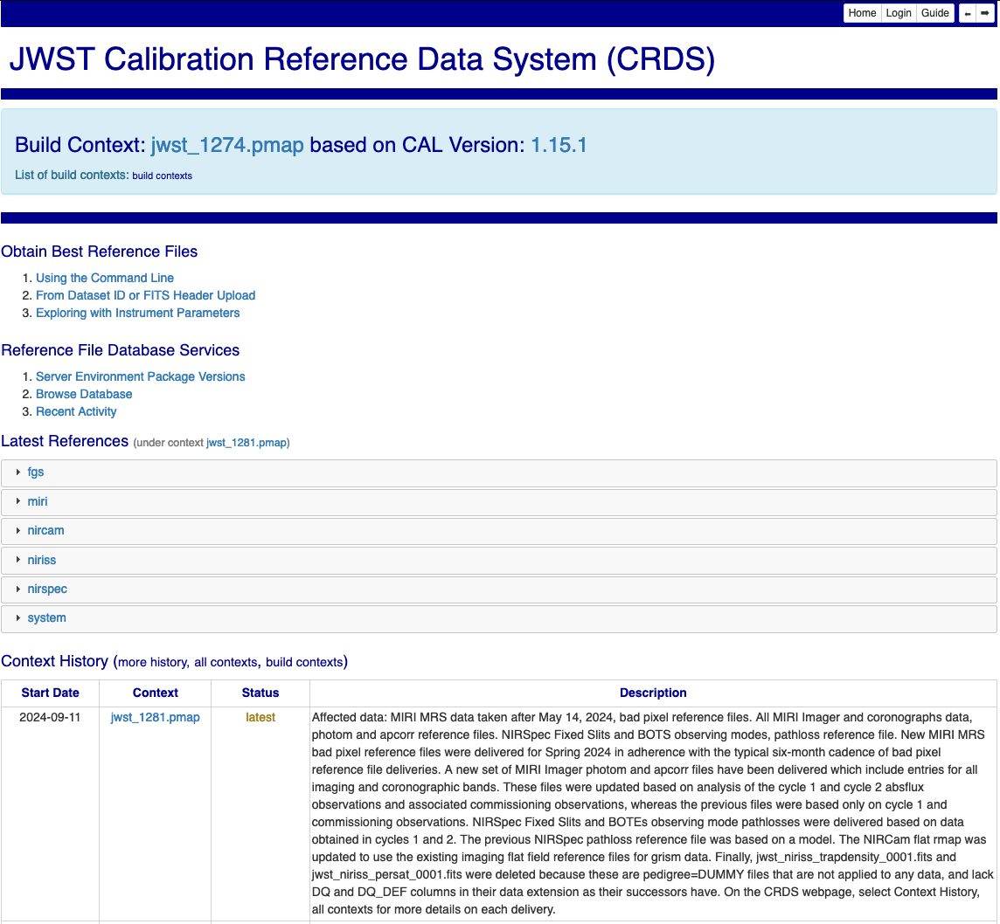

Functions annotated with the word `alpha` are partially completed components of
a future build which may prove useful now.

For HST

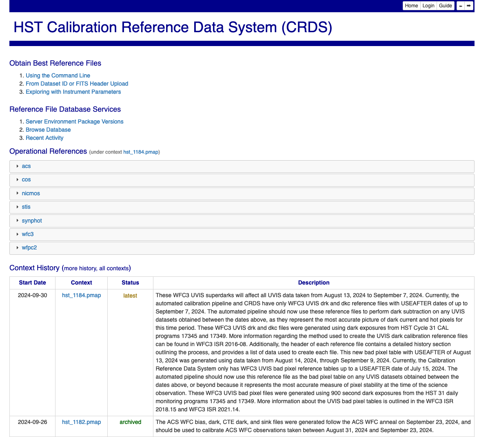

<--Applicable only to JWST and RST

Build Context Banner
----------------------
The Build Context Banner displays the CRDS Context that was delivered with a DMS build, and
is guaranteed to work with that build. It will be the latest context when a DMS build is installed,
but will not be the most current after references get delivered and the latest context is updated.

Clicking on the `build contexts` link will bring up a table that displays the JWST Calibration Code Version that was
available when a particular context was delivered.

.. figure:: images/web_context_build_table.png
   :scale: 50 %
   :alt: Build CRDS contexts

-->

Latest References
----------------------

The *Latest References* table displays the references which are currently in use
by the pipeline associated with this web site.   

Each instrument accordion opens into reference type accordions for that instrument.

Each reference type accordion opens into a table of reference files.

In general,  links to files will either lead to the CRDS catalog details about that
file or to a context display for a different .pmap.

Context History (more)
----------------------

The *Context History* displays the last 4 CRDS contexts which were the latest to be used by the pipeline. Clicking on the `more history` link will bring up
the entire context history as a separate page as shown below:

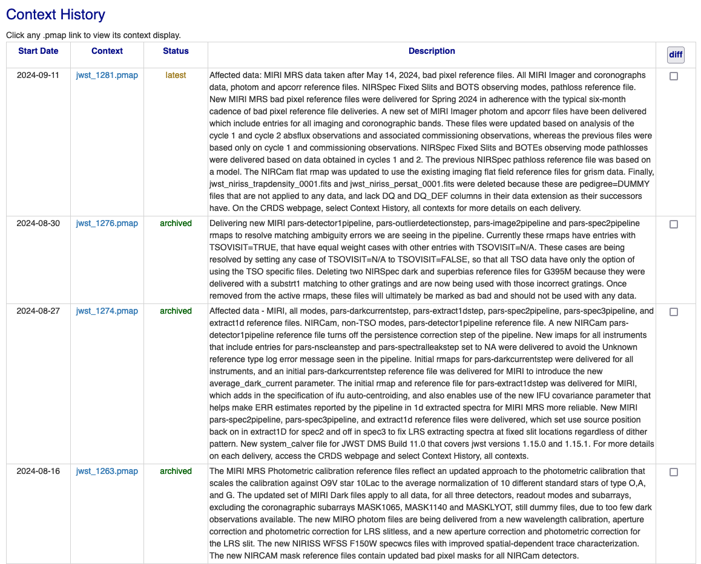
   
Click the `diff` check box for any two contexts in the history and then click
the diff button at the top of the diff column:

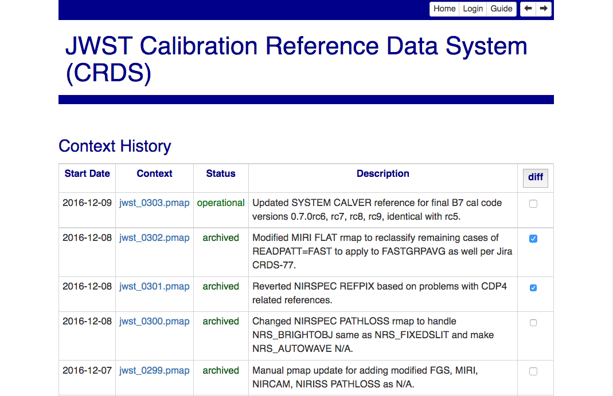

This will display a difference page with an accordion panel for each file which
differed between the two contexts:
    
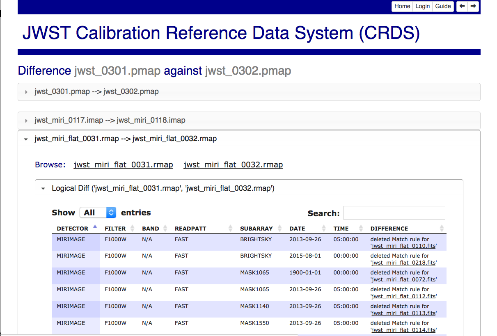

Each file accordion opens into two accordions which alternately display logical
and simple textual differences.

The logical differences display a table of matching parameters and files which
were added, deleted, or replaced.  The textual differences show raw UNIX diffs
of the two rules files.

Clicking on the `all contexts` link will bring up every context that has ever been delivered:

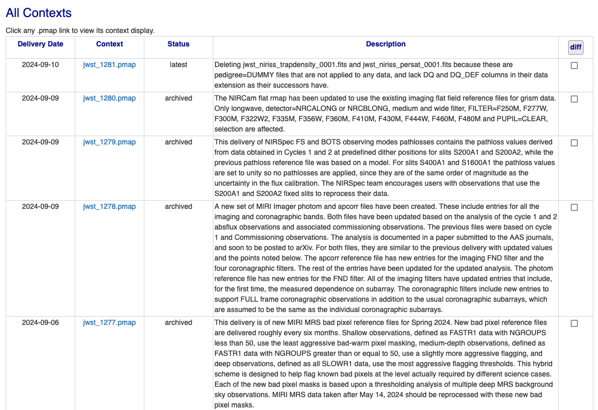

<--Applicable only to JWST and RST

Clicking on the `build contexts` link will bring up a table that displays the JWST Calibration Code Version that was
available when a particular context was delivered, just as it did in the banner.

Clicking a `Cal Ver` link will take you to the github release of that JWST Calibration version:

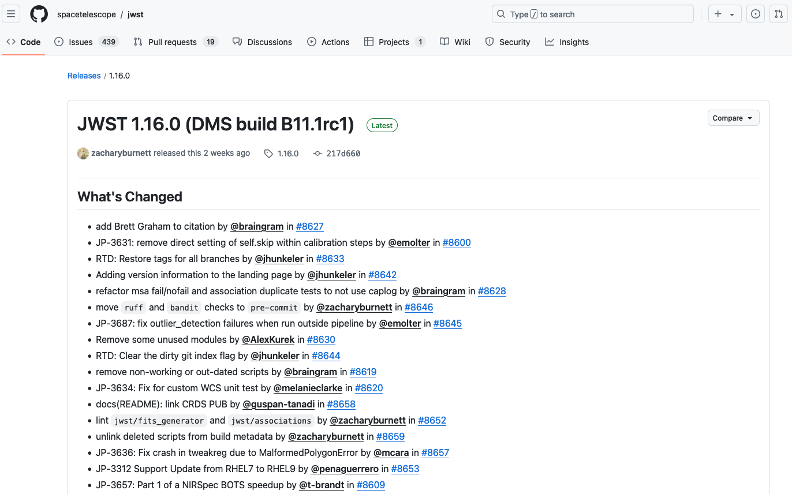

-->

Clicking on any `context` link (the .pmap name) in the history, all contexts, or build contexts tables opens a
page containing the References for some point in the past, similar to the Latest References display:

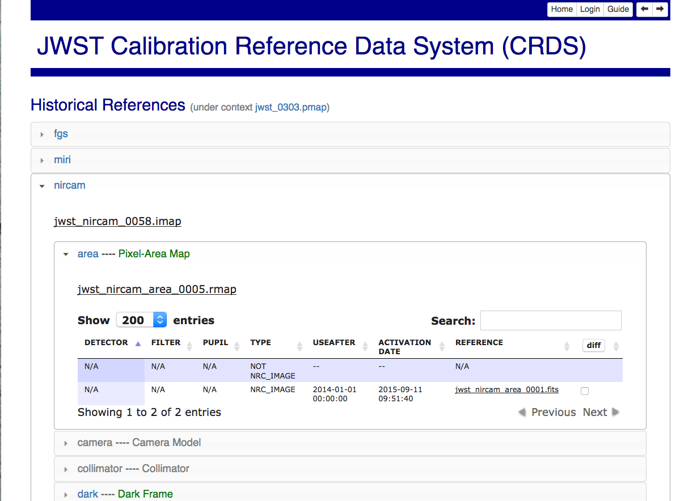

Open Services
-------------

The following functions are available for anyone with access to the CRDS web
server and basically serve to distribute information about CRDS files and
recommendations. Initially, the CRDS sites are only visible within the Institute.

Dataset Best References from Dataset ID or FITS Header Upload
.............................................................

The *Dataset Best References* page supports determining the best references for
a single dataset with respect to one CRDS context. Best references are based 
upon a CRDS context and the parameters of the dataset as determined by the 
dataset file itself or a database catalog entry.

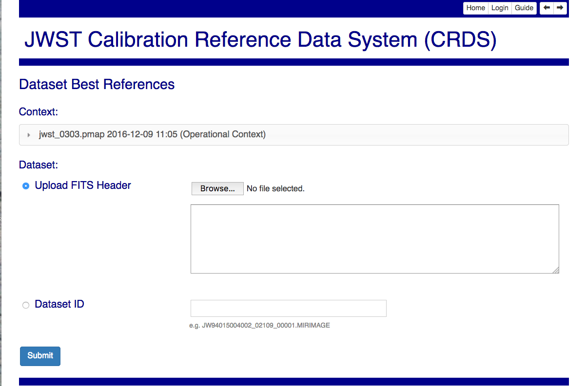

Context
+++++++

The context defines the set of CRDS rules used to select best references.
*Edit* is the default context from which most newly created contexts are derived.  
*Latest* is the context currently in use by the pipeline.   *Recent* shows
the most recently created contexts.   *User Specified* enables the submitter to 
type in the name of any other known context.

Dataset
+++++++

Upload FITS header
!!!!!!!!!!!!!!!!!!

Browser-side code can extract the FITS header of a dataset and upload it to the
server where best references are computed based on dataset parameters.   This
function is implemented in Javascript and reliant on HTML5;  it supports only
parameters present in the FITS primary header.   It avoids uploading most of the
dataset.   It is known to work in Firefox and Chrome but not IE or Safari-5.
  
Archived Dataset
!!!!!!!!!!!!!!!!

Datasets can be specified by ID and their best reference input parameters will 
be retrieved from the catalog.

Dataset Best References Results
+++++++++++++++++++++++++++++++

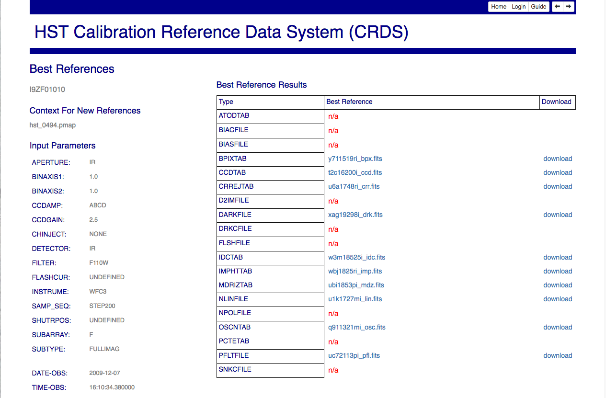
   
The results page for dataset best references displays the input parameters which
were extracted from the dataset header on the right side of the page.

Best reference recommendations are displayed on the left side of the page.

Explore Best References with Instrument Parameters
..................................................

Explore best references is a sand box that enables evaluating what CRDS will do
given hand picked parameter values.  Explore Best References supports entering
best references parameters directly via menus or write-in text boxes rather
than extracting them from a dataset or catalog.

The first phase of exploration is to choose a pipeline context and instrument
which will be used to define menu driven parameter choices:   

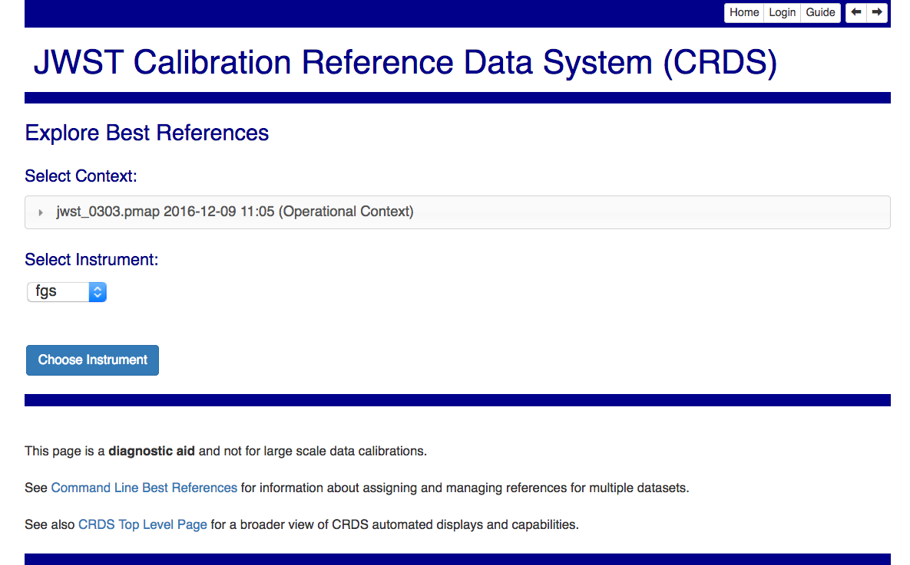

The second phase is to enter the parameters of a dataset which are relevant 
to best references selection.  

.. figure:: images/web_explore_bestrefs_parameters.png
   :scale: 50 %
   :alt: user input based best references

The parameter menus are driven by CRDS rules and do not capture every possible
parameter value.  Text box inputs augment and override the menu inputs to
support entering parameter values not listed in the menus.

The entered parameters are evaluated with respect to the given pipeline context
and best references are determined.   The results are similar or identical to
the *Dataset Best References* results.

Browse Database
...............

The *Browse Database* feature enables examining the metadata and properties of
CRDS reference and mapping files.

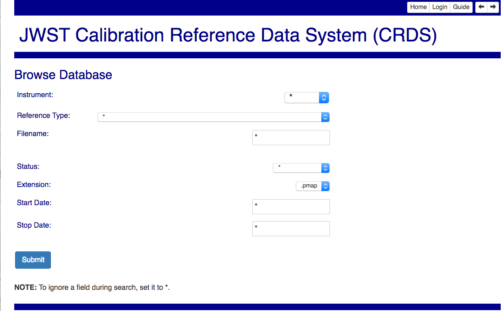

The first phase selects and filters files for top level display, one file per
table row.  Leave filter settings as \* to skip that constraint.

.. figure:: images/web_browse_database_files.png
   :scale: 50 %
   :alt: database browse filter page

All file details for a single file can be displayed by clicking the filename
link in the tabular display.
         
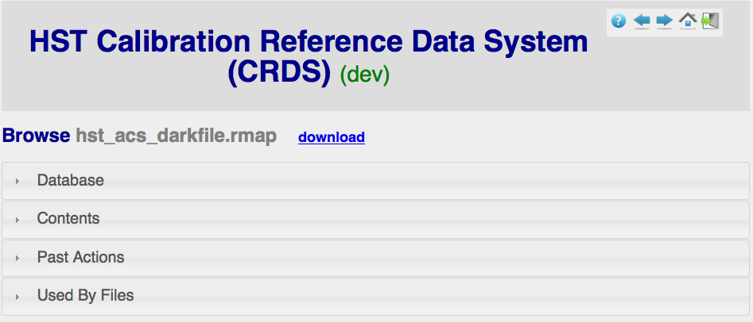
   
The file details page has a number of accordion panes which open when you
click on them.  All file types have these generic panes:

- Database - lists a table of CRDS metadata for the file.

- Contents - shows the text of a mapping or internal details about a reference file.

- Past Actions  - lists website actions which affected this file.

- Used By Files - list known CRDS files which reference this file.

Reference files have these additional panes:

- Lookup Patterns - lists the parameters sets which lead to this reference.

Recent Activity
...............

The *Recent Activity* view shows a table of the tracked actions on CRDS files:

.. figure:: images/web_recent_activity.png
   :scale: 50 %
   :alt: database browse details page
   
The first page lists a number of constraints which can be used to choose
activities of interest.   To ignore any constraint,  leave it set at the default
value of `*`.   The result of the activity search is a table of matching actions:

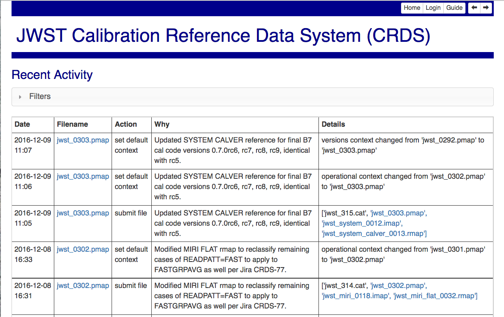
   
The default filter of `*.pmap` previews contexts that have been submitted but
not yet selected for latest use in the pipeline.

Authenticated Services
----------------------

See :ref:`file-submissions`.
