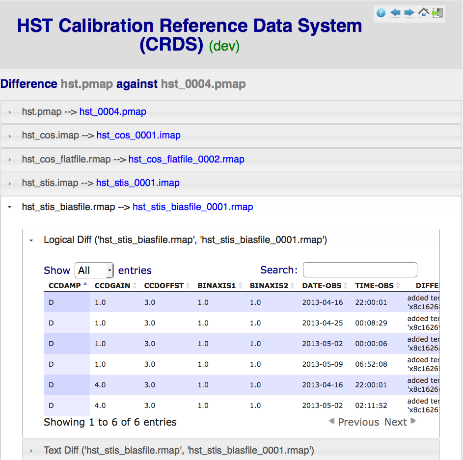

Using the CRDS Web Site
=======================

CRDS has websites at hst-crds.stsci.edu_ and jwst-crds.stsci.edu_ which support the submission, use,
and distribution of CRDS reference and mappings files.   Functions on the CRDS
website are either public functions which do not require authentication or private
functions which require a CRDS login account.

.. _hst-crds.stsci.edu: http://hst-crds.stsci.edu/
.. _jwst-crds.stsci.edu: http://jwst-crds.stsci.edu/

.. figure:: images/web_index.png
   :scale: 50 %
   :alt: home page of CRDS website

Functions annotated with the word (alpha) are partially completed components of
a future build which may prove useful now.

Operational References
----------------------

The *Operational References* table displays the references which are currently in use
by the pipeline associated with this web site.   The operational context is displayed
as a link '(under context <link>)' immediately below Operational References.  Clicking
the link opens a details browser for that CRDS .pmap reference assignment rules file.   
The operational context is the latest context in the Context History,  the one in 
active use for pipeline processing by default.

Each instrument accordion opens into reference type accordions for that instrument.

Each type accordion opens into a table of reference files and the dataset parameters 
they apply to.   Each reference file link opens into a details browser for that reference
file.

Context History (more)
----------------------

The *Context History* displays the last 4 CRDS contexts which were in operational use by
the pipeline associated with a CRDS server. Clicking on the *(more)* link will bring up 
the entire context history as a separate page as shown below:

.. figure:: images/web_context_history.png
   :scale: 50 %
   :alt: History of CRDS operational contexts
   
Clicking on a *context* link (the .pmap name) opens a page containing the Historical References
for some point in the past,  similar to the Operational References display:

.. figure:: images/web_context_table.png
   :scale: 50 %
   :alt: CRDS historical references display
   
References are displayed in accordion panels for each instrument.   Opening the panel for
an instrument displays the reference types of that instrument.  Opening the panel for a type
displays particular reference files and matching parameters for that type.   Clicking on a particular
reference file brings up the CRDS browser page with the known details for that reference.

Differencing contexts
.....................

Click the *diff* checkbox for any two contexts in the history and then click the diff button
at the top of the diff column.   This will display a difference page with an accorion panel
for each file which differed between the two contexts:
    

Each file accordion opens into two accordions which display different views of the differences,
logical or textual.  The logical differences display a table of matching parameters and files
which were added, deleted, or replaced.   The textual differences show raw UNIX diffs of the
two rules files.

Open Services
-------------

The following functions are available for anyone with access to the CRDS web
server and basically serve to distribute information about CRDS files and
recommendations.   Initially,  the CRDS sites are only visible within the Institute.

Dataset Best References
.......................

The *Dataset Best References* page supports determining the best references for
a single dataset with respect to one CRDS context.   Best references are based 
upon a CRDS context and the parameters of the dataset as determined by the 
dataset file itself or a database catalog entry.

.. figure:: images/web_dataset_bestrefs.png
   :scale: 50 %
   :alt: dataset based best references input page

Context
+++++++

The context defines the set of CRDS rules used to select best references.
*Edit* is the default context from which most newly created contexts are derived.  
*Operational* is the context currently in use by the pipeline.   *Recent* shows
the most recently created contexts.   *User Specified* enables the submitter to 
type in the name of any other known context.

Dataset
+++++++

Upload FITS header
!!!!!!!!!!!!!!!!!!

Browser-side code can extract the FITS header of a dataset and upload it to the
server where best references are computed based on dataset parameters.   This
function is implemented in Javascript and reliant on HTML5;  it supports only
parameters present in the FITS primary header.   It avoids uploading most of the
dataset.   It is known to work in Firefox and Chrome but not IE or Safari-5.
  
Archived Dataset
!!!!!!!!!!!!!!!!

Datasets can be specified by ID and their best reference input parameters will 
be retrieved from the catalog.

Dataset Best References Results
+++++++++++++++++++++++++++++++

.. figure:: images/web_dataset_bestrefs_results.png
   :scale: 50 %
   :alt: dataset based best references results page
   
The results page for dataset best references displays the input parameters which
were extracted from the dataset header on the right side of the page.

Best reference recommendations are displayed on the left side of the page.

Explore Best References
.......................

Explore Best References supports entering best references parameters directly
rather than extracting them from a dataset or catalog.   Explore best references
is essentially a sand box which lets someone evaluate what CRDS will do given
particular parameter values.  The explorer currently lists all parameters 
which might be relevant to any mode of an instrument and has no knowledge of 
default values.  

The first phase of exploration is to choose a pipeline context and instrument
which will be used to define parameter choices:   

.. figure:: images/web_explore_bestrefs.png
   :scale: 50 %
   :alt: user input based best references

The second phase is to enter the parameters of a dataset which are relevant 
to best references selection.  

.. figure:: images/web_explore_bestrefs_parameters.png
   :scale: 50 %
   :alt: user input based best references

The entered parameters are evaluated with respect to the given pipeline context
and best references are determined.   The results are similar or identical to
the *Dataset Best References* results.

Browse Database
...............

The *Browse Database* feature enables examining the metadata and computable
properties of CRDS reference and mapping files.

.. figure:: images/web_browse_database.png
   :scale: 50 %
   :alt: database browse filter page

The first phase is to enter a number of filters to narrow the number or variety 
of files which are displayed.   Leaving any filter at the default value of *
renders that constraint irrelevant and all possible files are displayed with
respect to that constraint.   The result of the first phase is a table of files
which matched the filters showing their basic properties.

.. figure:: images/web_browse_database_files.png
   :scale: 50 %
   :alt: database browse filter page

The second phase is initiated by clicking on the filename link of any file
displayed in the table from the first phase.   Clicking on a filename link switches
to a detailed view of that file only:

.. figure:: images/web_browse_database_details.png
   :scale: 50 %
   :alt: database browse details page
   
The file details page has a number of accordion panes which open when you
click on them.  All file types have these generic panes:

- Database - lists a table of CRDS metadata for the file.

- Contents - shows the text of a mapping or internal details about a reference file.

- Past Actions  - lists website actions which affected this file.

- Used By Files - list known CRDS files which reference this file.

Reference files have these additional panes:

- Certify Results - shows the results of crds.certify run on this reference now.

- Lookup Patterns - lists the parameters sets which lead to this reference.

Recent Activity
...............

The *Recent Activity* view shows a table of the actions on CRDS files which
are tracked.  Only actions which change the states of files in some way are 
tracked:

.. figure:: images/web_recent_activity.png
   :scale: 50 %
   :alt: database browse details page
   
The first page lists a number of constraints which can be used to choose
activities of interest.   To ignore any constraint,  leave it set at the default
value of \*.   The result of the activity search is a table of matching actions:

.. figure:: images/web_recent_activity_results.png
   :scale: 50 %
   :alt: database browse details page
   
The details vary by the type of action,  in this case showing the original name
of a file prior to submission to CRDS and the assignment of its official name.

Private Functions
-----------------

The following functions are restricted to users with accounts on the CRDS website
and support the submission of new reference and mapping files and maintenance
of the overall site.   Private functions are only visible to users who have 
successfully logged in.

Login and Instrument Locking
............................

Typical batch file submissions automatically generate instrument and pipeline context
files,  as well as .rmaps.   To preclude the possibility of multiple users submitting
files from the same instrument at the same time,  and possibly creating conflicting
rules,  users lock instruments when they log in.

.. figure:: images/web_login.png
   :scale: 50 %
   :alt: login page with instrument locking

When a user logs in,  the instrument they've locked and the time remaining on the 
lock are displayed below the login (now logout) button:

.. figure:: images/web_logged_in.png
   :scale: 50 %
   :alt: logged in page with count down timer

The time displayed is the relative time remaining on the lock reservation,  nominally
around 4 hours with the current server configuration.

When the user performs an action on the website,  their lock timer is reset to its maximum value.
As time passes without action,  the lock timer counts down.  When the lock timer reaches zero, 
the lock is automatically released and any on-going file submission is cancelled.   Files which 
have been uploaded for a cancelled submission are left in the upload area.

Other users who attempt to login while an instrument is locked will be denied.

When a file submission is being performed,  it must be *confirmed* within the timeout period
or the file submission will be cancelled.

Care should be taken with the locking mechanism and file submissions.  **DO NOT**:

* Don't login from multiple browsers or sites.   The last browser/site you log in from will steal the
  lock from the original login, cancel any original file submission,  and force a logout in the original browser.

* Don't leave the page during an ongoing file submission,  wait for it to finish.   Opening other browser
  tabs should be fine.

* Don't attempt to login for more than one instrument at a time.  One user is assigned one and only one lock.

* Don't attempt to perform multiple file submissions for the same instrument at the same time.  Finish
  and confirm or cancel each file submission before proceeding with the next.

Certify Files
.............

*Certify File* runs crds.certify on the files in the ingest directory.

.. figure:: images/web_certify_file.png
   :scale: 50 %
   :alt: certify file inputs
   
If the certified file is a reference table,  the specified context is used to
locate a comparison file. 

Mark Files Bad
..............

*Mark Files Bad* supports marking a file as scientifically invalid and
also supports reversing the decision and marking it good once more.

The CRDS procedure for marking files bad requires three steps:

1. Create a clean context which does not contain any prospective bad files.
2. Make the clean context operational using Set Context.
3. Mark the prospective bad files actually bad using Mark Bad Files.

Following this procedure maintains the invariant that the operational context
contains no known bad files.   The designation as bad files does not take
effect until any local CRDS cache is synchronized with the server.

Creating a clean context can be done in arbitrary ways,  but the two most
common ways will likely be:

1. Submit replacement files for the bad files to create a clean context.
2. Use Delete References to generate a new context without the bad files.

.. figure:: images/web_mark_files_bad.png
   :scale: 50 %
   :alt: mark files bad inputs

Marking a rules file (mapping) as bad implicitly marks all the files
which refer to it as bad.  Hence,  marking a .rmap as bad will make
any .imap which refers to it bad as well,  and will also taint all .pmaps
which refer to the bad .imaps.   Whenever a rules file is marked bad,
a warning is issued when the containing context is used.

Marking a reference file as bad is a more precise technique which invalidates
only that reference in every context that includes it.  Warnings are issued
related to the bad reference only when the reference is actually recommended by
CRDS.

By default, recommendation of bad files is an error.  The default
behaviour can be overrideden, allowing use of bad rules or references with a
warning, by setting environment variables: *CRDS_ALLOW_BAD_RULES* and/or
*CRDS_ALLOW_BAD_REFERENCES* or by using command line switches for
crds.bestrefs: *--allow-bad-rules* and *--allow-bad-references*.

Delete References
.................

*Delete References* supports supports removing references (but not rules) from
a context generating a new context.  Delete References provides one
straightforward way to generate clean rules prior to marking the deleted files
as bad.

.. figure:: images/web_delete_references.png
   :scale: 50 %
   :alt: delete references

Delete References does not remove the files from CRDS, it only removes them
from the specified set of rules.  The references remain available under any
contexts which still refer to them.

Once references have been replaced or deleted from the operational context and
the new context is made operational using Set Context, the deleted or replaced
references can be marked as scientifically invalid using Mark Files Bad.

Files are specified for Delete References by listing their names in the Deleted
Files field of the input form, separated by spaces, commas, and/or newlines.

Changes to rules which result from delete references are presented on a results
page which must be confirmed or cancelled as with other file submissions.

Add References
..............

*Add References* supports adding existing CRDS references to a CRDS context
which does not contain them already.  Add References is the inverse of Delete
References and generates new CRDS rules without requiring the resubmission of
files to CRDS.

.. figure:: images/web_add_references.png
   :scale: 50 %
   :alt: add references

Add references can be used to undo the effects of Delete References in a
perhaps distant descendant context containing other changes.  Add references
can also be used to add tested references from a branched context into the
current operational context.

Files are specified for Add References by listing their names in the Added
Files field of the input form, separated by spaces, commas, and/or newlines.

Changes to rules which result from add references are presented on a results
page which must be confirmed or cancelled as with other file submissions.
Rules changes from add references should be carefully reviewed to ensure that
the resulting rmap update is as intended.  In particular, other rmap
differences from a branched context are not added, so additional test
parameters or other header and structural changes of any test rmap are not
carried over by Add References,  only the reference files themselves.

Set Context
...........

*Set Context* enables setting the operational and edit contexts.  

.. figure:: images/web_set_context.png
   :scale: 50 %
   :alt: set context inputs

CRDS enables contexts to be pre-positioned before their adoption as the default
for processing by the pipeline.  Only by using Set Context will an available 
context become the default for processing.
   
Setting the operational context makes the specified context the default for
processing coordinated by this server.  Setting the operational context creates
a new entry at the top of the Context History.

Setting the edit context makes the specified context the default starting point
for future contexts created during file submission.

Batch Submit References
.......................

*Batch Submit References* is intended to handle the majority of CRDS reference
submissions with a high degree of automation.   This page accepts a number of
reference files and metadata which is applied to all of them.   The specified
reference files are checked on the server using crds.certify and if they pass
are submitted to CRDS.   All of the submitted references must be of the same
reference type,  i.e. controlled by the same .rmap file.   Tabular reference 
files are checked with respect to the derivation context by crds.certify.

.. figure:: images/web_batch_submit_references.png
   :scale: 50 %
   :alt: batch reference submission inputs
   
Upload Files
++++++++++++

The first task involved with *Batch Submit References* is transferring the
submitted files to the server.  For CRDS build-2,  there are two approaches for
getting files on the server,  web based and shell based.   Both approaches
involve transferring files to an ingest directory in the CRDS filestore.  Each
CRDS user will have their own ingest directory.   Initially the only user is
"test".   This section applies equally to all of the file submission pages that
have an *Upload Files* accordion.   

Web Approach
!!!!!!!!!!!!

On the file submission pages,  the *Upload Files* accordion opens to support
uploading submitted files to a user's CRDS ingest directory via the browser.

.. figure:: images/web_upload_files.png
   :scale: 50 %
   :alt: file upload accordion

Uploading files is accomplished by:

* Opening the accordion panel by clicking on it.

* Add files to the upload list by clicking on the *Add Files...* button.  Alternately for modern browsers (Chrome) drag-and-drop files from your desktop to the upload accordion.

* Click *Start Upload* to initiate the file transfer.   You should see a progress bar(s) showing the status of the upload(s).   When the upload successfully completes the buttons will change to *delete*.

* Click *Delete* for any file added by mistake or for failed uploads.

* Click *Cancel Upload* to abort a file transfer during the upload.

* Close the accordion panel by clicking on it.

**IMPORTANT**  Just adding files to the file list does not upload them.   You
must click *Start upload* to initiate the file transfer.   In the screenshot above,
the file with the *delete* button next to it is already on the server in the
ingest directory.   The files with *start* and *cancel* buttons next to them have
only been declared as candidates for upload.   To finish uploading all 3 files,  
check *select all* and click *Start upload*.

Shell Approach
!!!!!!!!!!!!!!

In the shell approach a user must login to UNIX (in some fashion) and transfer
files into their CRDS ingest directory manually.   The nominal approach
for doing this is to use the cp or scp commands.   For instance,  from my home,
having already set up ssh and scp access, I might say::

  % scp /this_delivery/*.fits   dmsinsvm.stsci.edu:/ifs/crds/hst/test/server_files/ingest/mcmaster

to copy references into my ingest directory *as-if* I had uploaded them through
the uploads panel.

Abstractly this is::

  % scp <submitted reference files...>   <host>:/ifs/crds/hst/<pipeline>/server_files/ingest<crds_username>
  
where pipeline is 'test' or 'ops'.

The submitted reference files should now be in the ingest directory for *HST* test server
user *mcmaster*.   Once the files are in the ingest directory,  the CRDS web server
will behave as if they had been uploaded through web interface.  Refreshing the
file submission web page should make manually copied files show up in the
*Upload Files* accordion.

The purpose of using cp or scp is to improve the efficiency and reliability of
the file transfers should those become an issue.  Telecommuters working offsite by VPN
would face a situation where submitted files are downloaded to their home computer via
VPN and then uploaded to the CRDS server via their browser. 

Files transferred to the ingest directory via shell should
still be removeable using the *Upload Files* delete buttons.

Derive From Context 
+++++++++++++++++++

The specified context is used as the starting point for new automatically 
generated context files and also determines any predecessors of the submitted 
references for comparison during certification.   If all the submitted reference
files pass certification,  a new .rmap, .imap, and .pmap are generated
automatically to refer to the newly entered references.    Based on their
header parameters,  references are automatically assigned to appropriate
match locations in the .rmap file.

.. figure:: images/web_derive_from_context.png
   :scale: 50 %
   :alt: context specification

There are two special contexts in CRDS which are tracked:

Edit Context
!!!!!!!!!!!!

Edit Context is the default context used for editing.   Whenever a new .pmap is created or
added,  it becomes the editing context from which other .pmaps are derived by
default.

Operational Context
!!!!!!!!!!!!!!!!!!!

Operational Context is the .pmap which is nominally in use by
the pipeline.  Generally speaking,  multiple contexts might be added to CRDS as
the Edit Context long before they become operational.   

Recent 
!!!!!!

Recent lists a number of recently added contexts based on delivery time.   

User Specified
!!!!!!!!!!!!!!

Any valid CRDS context can be typed in directly as User Specified.
   
Auto Rename
+++++++++++

Normally files uploaded to CRDS will be assigned new unique names.   During side-by-side
testing with CDBS,  *Auto Rename* can be deselected so that new files added to CRDS
retain their CDBS names for easier comparison.  The CRDS database remembers both
the name of the file the submitter uploaded as well as the new unique name.
   
Compare Old Reference
+++++++++++++++++++++

When checked CRDS will certify incoming tabular references against the files
they replace with respect to the derivation context.   For other references this 
input is irrelevant and ignored.

Results
+++++++

.. figure:: images/web_batch_submit_results.png
   :scale: 50 %
   :alt: batch submission results
   
The results page lists the following items:

* *Starting Context* is the context this submission derove from.

* *Generated New Mappings* lists the new mapping files which provide the generated context for using the submitted references.

* *Actions on Rmap* provides two accordions showing how the rmap controlling the submitted references was modified.   The logical differences accordion has a table of actions,  either *insert* for completely new files or *replace* for files which replaced an existing file.   The text differences are essentially output from UNIX *diff* for the old and new rmaps.

* *Certify Results* has an accordion panel for each submitted reference file which contains the results from crds.certify.   The submitted name of each file is listed first,  followed by any official name of the file assigned by CRDS.   The status of the certification can be "OK" or "Warnings".   Warnings should be reviewed by opening the accorion panel.
   
**IMPORTANT**  The results page only indicates the files which will be added to
CRDS if the submission is *confirmed*.   Prior to confirmation of the submission,
neither the submitted references nor the generated mappings are officially in CRDS.
Do not *leave the confirmation page* prior to confirming.

Collisions
++++++++++

Under some circumstances,  a *Collision Warning* accordion will be present.
It should be carefully examined to ensure that overlapping edits of the
same context file have not occurred.   Overlaps can be resolved by cancelling
the current submission and re-doing it, or by accepting the current submission
and manually correcting the mappings involved.   Failure to correctly resolve
a collision will most likely result in one of two sets of conflicting changes
being lost.

.. figure:: images/web_collision_warnings.png
   :scale: 50 %
   :alt: collision warnings
   
Collision tracking for CRDS mappings files is done based upon header fields,
nominally the *name* and *derived_from* fields.  These fields are automatically
updated when mappings are submitted or generated.

Collision tracking for reference files is currently filename based.   The submitted
name of a reference file is assumed to be the same as the file it 
was derived from.   This fits a work-flow where a reference is first downloaded
from CRDS, modified under the same name,  and re-uploaded.   Nominally,  submitted
files are automatically re-named.

Confirm or Discard
++++++++++++++++++

If everything looks good the last step is to click the *Confirm* button.
Clicking the Confirm button finalizes the submission process,  submits the files
for archive pickup,  and makes them a permanent part of CRDS visible in the 
database browser and potentially redistributable.   A confirmed submission 
cannot be revoked,  but neither will it go into use until the pipeline or a 
user explicitly requests it.

*Discarding* a batch submission based on warnings or bad rmap modifications
removes the submission from CRDS.   In particular temporary database records
and file copies are removed.

Following any CRDS pipeline mapping submission,  the default *edit* context
is updated to that pipeline mapping making it the default starting point for
future submissions.

Submit References
.................

*Submit References* provides a lower level interface for submitting a list of 
references.   No mappings are generated to refer to the submitted files.
Submitted references must still pass through crds.certify.

.. figure:: images/web_submit_references.png
   :scale: 50 %
   :alt: create contexts inputs

Submit Mappings
...............

*Submit Mappings* provides a basic interface for submitting a list of mapping
files which don't have to be related.   This can be used to submit context files
which refer to files from *Submit References* and with fewer restrictions on
allowable changes.   Typically only .rmaps are submitted this way.   Mappings
submitted this way must also pass through crds.certify.   

.. figure:: images/web_submit_mappings.png
   :scale: 50 %
   :alt: create contexts inputs

   
Mapping Change Procedure
++++++++++++++++++++++++

The nominal process used to modify CRDS mappings is to:

1. Download the mapping to be used as a baseline for the revised version.
Leave the name as-is.  The download can be accomplished by using the crds.sync
tool to download the file to a local cache, or by browsing to the file's
details page and using the *download* link near the top of the page.  Likewise
the source file can be copied directly from the shared on site default 
readonly cache.   This download, don't rename, upload process is used to
automatically maintain the derivation history of mappings in their headers,
the name field is progagated down to the derived_from field to track the
source mapping prior to renaming the new mapping.

2. Modify the mapping in a text editor implementing required changes.  Use
care editing mappings since many aspects of the mapping cannot be verified by
crds.certify.   Where possible match values are validated against CRDS .tpn
files or JWST data model schema.

3. Run crds.certify on the resulting mapping, using the current operational
context as the point of comparison::

% python -m crds.certify ./jwst_miri_dark_0004.rmap  --comparison-context jwst-operational

4. During iteration, run crds.checksum on the mapping to update the internal
sha1sum if you wish to load the context into Python to do interactive tests 
with the .rmap::

% python -m crds.checksum ./jwst_miri_dark_0004.rmap
% python
>>> import crds
>>> r = crds.get_cached_mapping("./jwst_miri_dark_0004.rmap")

The internal checksum can also be used to verify upload integrity when you
finally submit the file to CRDS, an out-of-date checksum or corrupted file will
generate a warning.   Alternately:: 

% setenv CRDS_IGNORE_MAPPING_CHECKSUMS 1 

to suppress mapping load errors due to invalid checksums during development.

